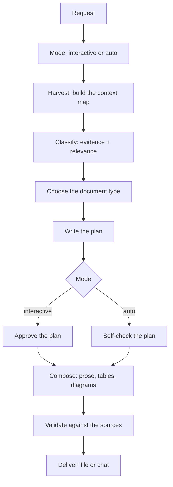

# doc-writer

Turns whatever context is available — the session, code, a diff, a spec, files you point at — into a
Markdown document that is grounded in the sources instead of filled in from what usually goes in that
section.

The work is deciding **what matters**, **what shape holds it**, and **what can honestly be claimed**.
Rendering Markdown is the last step and the cheapest one.

## Table of Contents

- [When it triggers](#when-it-triggers)
- [Modes](#modes)
- [The flow](#the-flow)
- [Use cases](#use-cases)
- [Templates](#templates)
- [Files](#files)
- [Rules that shape the output](#rules-that-shape-the-output)
- [What it does not do](#what-it-does-not-do)

## When it triggers

Anything that asks for something to be written up: "documentá esto", "document this", "armá un doc",
"write it up", "dejalo registrado" — and any named shape: architecture doc, ADR, runbook, API
reference, feature doc, investigation, project report.

You can also call it by name: `doc-writer`, `doc-writer auto`, `doc-writer interactive`.

## Modes

Same analysis in both. The difference is only where it stops to ask.

| Mode | What happens | Use when |
|---|---|---|
| **Interactive** | proposes a plan and waits for approval before writing | the scope is open, or the sources disagree |
| **Auto** | reviews its own plan and writes straight through | you want a fast capture of something you just did |

If you do not say which, it asks once. If you did say ("documentá esto automáticamente"), it does not
ask again.

Interactive means **gates, not interrogation** — there are three checkpoints in the entire flow: the
plan, scope when it is genuinely ambiguous, and the draft only when a conflict changed what the
document says.

## The flow



What each step actually does:

1. **Harvest** — reads the session, the files you named, the diff, existing docs, then the code those
   point at. Builds an internal context map: goal, audience, scope, sources, facts, unknowns,
   conflicts, discarded. It reads with a question in hand; it does not sweep the repo to "have
   context".
2. **Classify** — every fact gets an evidence level (confirmed / inferred / unknown / conflicting) and
   a relevance level (core / supporting / optional / noise). This is what keeps a two-hour session
   from becoming a two-hour document.
3. **Choose** — picks the document type from what the reader needs to do afterwards, then finds the
   matching template. Ranks two or three and says why the first wins.
4. **Plan** — the contract: type, goal, audience, sources, structure, visuals, what is excluded, what
   stays unknown, what conflicts. Cheap to fix here, expensive after ten sections.
5. **Compose** — adapts the template to the material. Drops sections the sources cannot fill, adds
   ones the material demands.
6. **Validate** — re-reads the **sources**, not the draft, and fixes or deletes anything that does not
   hold. This is the pass that catches the sentence that arrived from plausibility.
7. **Deliver** — file or chat, plus a short note on what was left out, what stayed unknown, and any
   conflict it documented instead of resolving.

## Use cases

| Situation | Document | Mode |
|---|---|---|
| Someone is joining the project and needs to get oriented | `technical-overview` | interactive |
| A change touches a boundary and you need the structure written down | `architecture` | interactive |
| You just built a feature and want it captured before the context is gone | `feature` | auto |
| Another team has to call your service | `api` | interactive |
| Two options were weighed and one won | `adr` | auto |
| A deploy or recovery procedure has to be repeatable by someone else | `runbook` | interactive |
| You debugged something and the findings must survive the session | `investigation` | auto |
| A sprint or migration is closing and work has to be handed over | `project-report` | auto |
| The material does not match any of the above | `generic` | either |

Rule of thumb: **interactive when someone else reads it, auto when it is a capture for you.**

## Templates

Templates live in `assets/templates/`. They are **discovered, not hardcoded** — the skill lists the
folder and reads each file's metadata block. Nothing needs editing when you add one.

### Using them

You do not have to pick. The skill recommends by matching your goal and audience against each
template's `use_when`, and shows you the ranking. You can override at the plan gate — "usá el de
architecture" — or ask up front ("documentá esto como ADR").

Templates are scaffolding, not forms. The skill drops a section the sources cannot fill and adds one
the material demands. A section left in only because the template had it teaches readers to skim.

### Adding one

Copy the closest existing template, edit it, and drop it in `assets/templates/`. It is available
immediately.

Each file starts with a metadata block:

```yaml
---
template:
  id: architecture              # must match the filename
  name: Architecture Overview   # shown when ranking candidates
  description: ...              # one line: what this document is for
  audience: [developers, architects]
  use_when:                     # what the ranking actually matches against
    - explaining how an existing system is put together
    - a change touches a boundary between components
  required: [overview, system-context, architecture, main-flows, summary]
  optional: [data-model, deployment, constraints]
  visuals: [component, flow, sequence, er]
  toc: required                 # required | optional | disabled
---
```

Two things to get right:

- **`use_when` carries the weight.** Selection matches intent, not names. Vague entries make the
  template win cases it should not.
- **`required` and `optional` are heading slugs** — the lowercased heading with spaces as dashes.
  `## Known Limitations` → `known-limitations`. They must match real sections in the file.

### What ships

`generic` · `technical-overview` · `architecture` · `feature` · `api` · `adr` · `runbook` ·
`investigation` · `project-report`

See `references/document-types.md` for what each one is for, the section skeleton it expects, and how
to tell apart the pairs that get confused (architecture vs overview, feature vs API, ADR vs
investigation).

## Files

```
doc-writer/
├── SKILL.md                      the flow: mode, harvest, classify, choose, plan, compose,
│                                 validate, deliver
├── references/                   loaded only when the document needs them
│   ├── document-types.md         catalog, disambiguation, section skeletons
│   ├── diagrams.md               which diagram, mermaid vs ascii, the no-invention guard
│   ├── tables.md                 when a table is the right form, and the patterns
│   └── validation.md             the five passes, grounding first
└── assets/templates/             the nine templates, discovered at runtime
```

`SKILL.md` stays small on purpose: it decides *which document to build*, templates decide *its shape*,
references decide *how to represent specialized material*, and validation keeps the result tied to the
sources.

## Rules that shape the output

- **Evidence before completeness.** An empty section is information. A filled-in one is a liability —
  the reader has no way to tell which sentences were grounded.
- **Relevance over volume.** The document is what survived the cut.
- **Visuals earn their place.** A diagram or table has to carry a relationship prose handles badly.
- **Never invent — least of all in a diagram.** A box with an arrow and a `1..N` reads as verified,
  and the reader builds on it. Unknown shapes get stated or left out.
- **Conflicts get stated, not resolved by preference.** Contradictory sources land in a table so
  whoever knows the answer can see it.
- **When the sources run out**: omit, then qualify, then ask. Never invent.

## What it does not do

- It does not review or update existing documentation against current code — that is a different
  problem (read a doc, read the code, report the drift) and belongs to a sibling skill, not here.
  The name leaves room for it: `doc-writer` writes, a future `doc-reviewer` checks drift.
- It does not draw diagrams as a standalone request. Diagram selection lives inside this skill; if you
  just want a picture, ask for it directly.
- It does not maintain what it writes. A document goes stale the moment the code moves.
