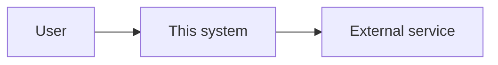
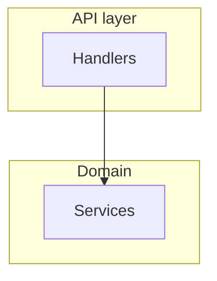
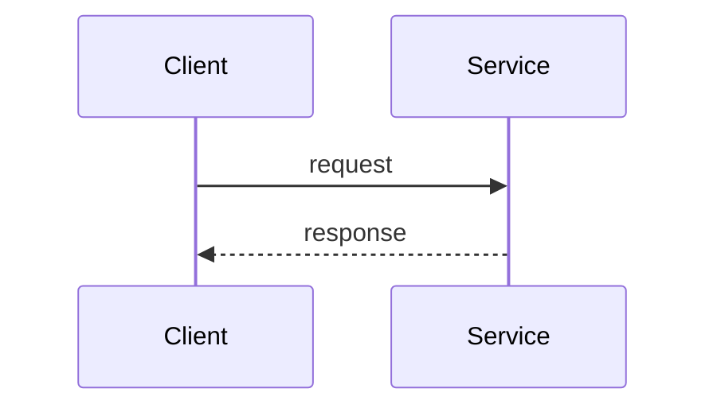
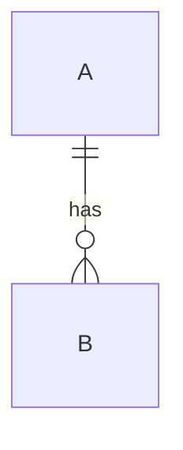

---
template:
  id: architecture
  name: Architecture Overview
  description: Explains system structure, boundaries, components and interactions - how the pieces fit together and why the seams are where they are.
  audience: [developers, architects, reviewers]
  use_when:
    - explaining how an existing system is put together
    - a change touches a boundary between components
    - documenting a design before or after it is built
  required: [overview, system-context, architecture, components-and-responsibilities, main-flows, summary]
  optional: [data-model, external-integrations, deployment, cross-cutting-concerns, constraints, known-limitations]
  visuals: [component, flow, sequence, er]
  toc: required
---

# [System] — Architecture

> [One or two lines: what this system does and what this document covers.]

## Table of Contents

- [Overview](#overview)
- [System Context](#system-context)
- [Architecture](#architecture)
- [Components and Responsibilities](#components-and-responsibilities)
- [Main Flows](#main-flows)
- [Data Model](#data-model)
- [External Integrations](#external-integrations)
- [Deployment](#deployment)
- [Cross-cutting Concerns](#cross-cutting-concerns)
- [Constraints](#constraints)
- [Known Limitations](#known-limitations)
- [Summary](#summary)

## Overview

[What the system does and the shape of its architecture in a paragraph. The one-sentence version of
everything below.]

## System Context

[What sits outside the boundary: users, upstream and downstream systems, external services. What
crosses the line in each direction.]

## Architecture

[The internal structure, and the reasoning behind the seams. Group with `subgraph` only where a real
boundary exists — a process, a deployment unit, a network zone. A subgraph drawn for tidiness reads
as an architectural claim.]

[A paragraph on what to look at: which boundaries are load-bearing, which are conventional.]

## Components and Responsibilities

| Component | Responsibility | Depends on | Notes |
|---|---|---|---|

[One subsection per component whose internals matter to someone changing it.]

## Main Flows

[The paths worth tracing end to end. One diagram each, plus prose. Sequence when actors exchange
messages over time; flowchart when the branching is the point.]

### [Flow name]

## Data Model

[Entities and their relations. Draw only relations the sources establish — an inferred cardinality on
an ER diagram is read as verified and built upon. Where a relation exists but its cardinality was not
established, say so instead of picking the usual one.]

## External Integrations

| System | Direction | Protocol | Purpose | Failure mode |
|---|---|---|---|---|

## Deployment

[Where it runs, what it runs as, how it scales. Include only what the sources confirm — deployment is
the section most often filled from convention.]

## Cross-cutting Concerns

[Authentication, authorization, logging, observability, error handling, transactions, caching —
whichever cut across components rather than living in one.]

## Constraints

[What the architecture is bound by: compatibility, latency, compliance, team, history. Constraints
explain shapes that otherwise look like mistakes.]

## Known Limitations

[Where the design strains, what it does not handle, what is known debt. Distinguish deliberate
trade-offs from accidents.]

## Summary

[The structure in a few lines, the parts that matter most, and the constraints a reader must respect
when changing it.]
