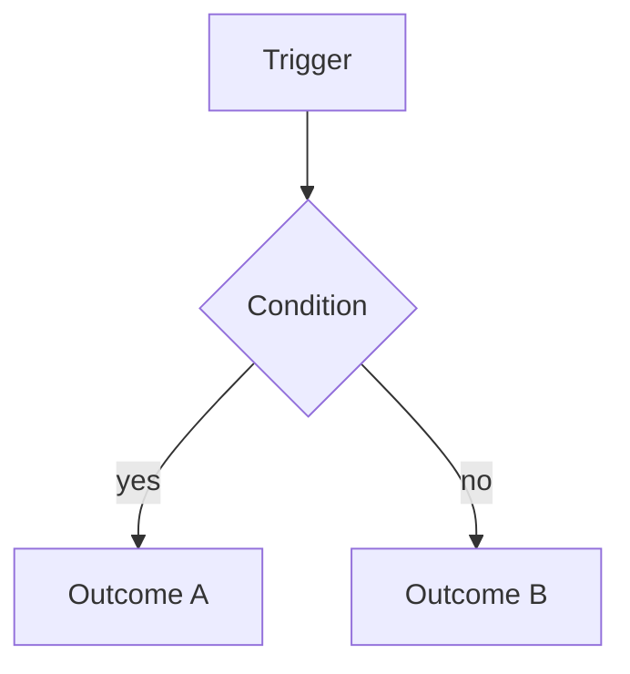

---
template:
  id: feature
  name: Feature Documentation
  description: Documents one capability - the problem it solves, how it behaves, where it touches the system, and where its edges are.
  audience: [developers, reviewers, QA, product]
  use_when:
    - a feature was built and needs to be documented
    - someone has to understand or change one capability
    - handing a feature over to another team
  required: [overview, problem, behavior, flow, summary]
  optional: [goals, non-goals, architecture-impact, data, interfaces, edge-cases, errors, configuration, testing, limitations]
  visuals: [flow, sequence, state]
  toc: required
---

# [Feature name]

> [One or two lines: what this feature does and for whom.]

## Table of Contents

- [Overview](#overview)
- [Problem](#problem)
- [Goals](#goals)
- [Non-Goals](#non-goals)
- [Behavior](#behavior)
- [Flow](#flow)
- [Architecture Impact](#architecture-impact)
- [Data](#data)
- [Interfaces](#interfaces)
- [Edge Cases](#edge-cases)
- [Errors](#errors)
- [Configuration](#configuration)
- [Testing](#testing)
- [Limitations](#limitations)
- [Summary](#summary)

## Overview

[What the feature does, in a paragraph, from the point of view of whoever uses it.]

## Problem

[What was wrong or missing before. A feature doc without this reads as a list of mechanics nobody can
evaluate.]

## Goals

- [what this feature has to achieve]

## Non-Goals

- [what it deliberately does not do, and where that lives instead]

## Behavior

[What happens, under which conditions, including the rules that decide between outcomes. The section
a reader comes back to.]

## Flow

[The path through the system. Flowchart when branching is the point, sequence when the exchange
between actors is.]

## Architecture Impact

[What this feature changed or added: components touched, new dependencies, boundaries crossed. What a
reviewer needs to know about blast radius.]

## Data

[New or changed entities, fields, migrations, retention. Include what is written when, since that is
what surprises people later.]

## Interfaces

[Endpoints, events, jobs, UI entry points — how the rest of the world reaches this feature.]

| Interface | Type | Purpose |
|---|---|---|

## Edge Cases

[The cases that were considered and how they resolve. An edge case listed with no resolution is an
open question — move it there rather than leaving it ambiguous.]

| Case | Behavior |
|---|---|

## Errors

| Condition | Result | What the caller should do |
|---|---|---|

## Configuration

| Setting | Required | Default | Effect |
|---|---|---|---|

## Testing

[How this is verified, and what is not covered. The gaps matter more than the coverage — they are
what the next person needs to know.]

## Limitations

[What it does not handle, known trade-offs, and what was deferred.]

## Summary

[What the feature does, the rules that govern it, and what a reader should watch out for when
changing it.]
