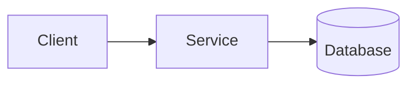

---
template:
  id: technical-overview
  name: Technical Overview
  description: Orients someone on a project, service or subsystem - what it is, what it does, how it is built, and how to work on it.
  audience: [developers, new team members, technical stakeholders]
  use_when:
    - onboarding someone onto a codebase or service
    - explaining a project end to end for the first time
    - a README needs to become a real document
  required: [overview, purpose-and-scope, architecture-at-a-glance, main-components, summary]
  optional: [key-concepts, how-it-runs, configuration, development-workflow, limitations]
  visuals: [component, flow]
  toc: required
---

# [Project / Service] — Technical Overview

> [One or two lines: what this system is and what it does.]

## Table of Contents

- [Overview](#overview)
- [Purpose and Scope](#purpose-and-scope)
- [Key Concepts](#key-concepts)
- [Architecture at a Glance](#architecture-at-a-glance)
- [Main Components](#main-components)
- [How It Runs](#how-it-runs)
- [Configuration](#configuration)
- [Development Workflow](#development-workflow)
- [Limitations](#limitations)
- [Summary](#summary)

## Overview

[What this system is, what problem it solves, and where it sits relative to everything around it. One
or two paragraphs — the reader is orienting, not studying.]

## Purpose and Scope

**Does:** [the responsibilities this system owns]

**Does not:** [what belongs to something else, and to what. This line prevents more wrong assumptions
than any other in the document.]

## Key Concepts

[Domain vocabulary a reader needs before the rest makes sense. Only terms this system uses in a
specific way — not a glossary of the industry.]

| Term | Meaning |
|---|---|

## Architecture at a Glance

[A component diagram when the structure is non-linear, plus a paragraph saying what to look at. If
the system is three files in a line, prose is better — delete the diagram.]

## Main Components

| Component | Responsibility | Depends on |
|---|---|---|

[Expand below only the components whose behavior a reader cannot infer from the table.]

## How It Runs

[Runtime, entry points, how it starts, what it needs to be available. Commands as they actually are —
never a plausible reconstruction.]

## Configuration

| Variable | Required | Default | Description |
|---|---|---|---|

## Development Workflow

[Setup, tests, build, and how a change gets from a local branch to running. Only steps confirmed by
the repo — a wrong command here costs the reader their first hour.]

## Limitations

[Known constraints, rough edges, and what this system is not good at. Include what was tried and
rejected if it stops someone repeating it.]

## Summary

[What this system is, the parts that matter most, and what a reader should now be able to do.]
