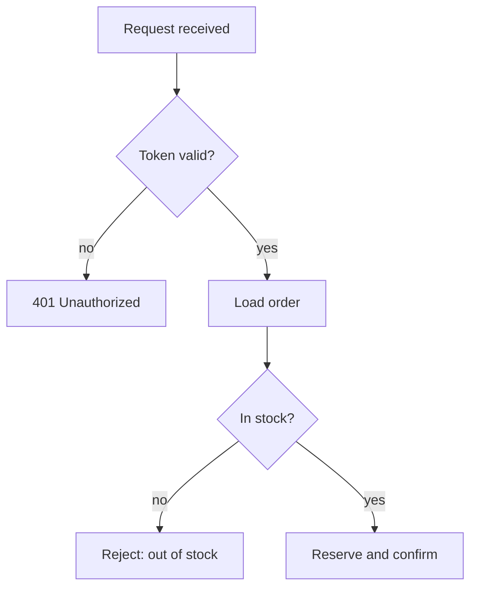
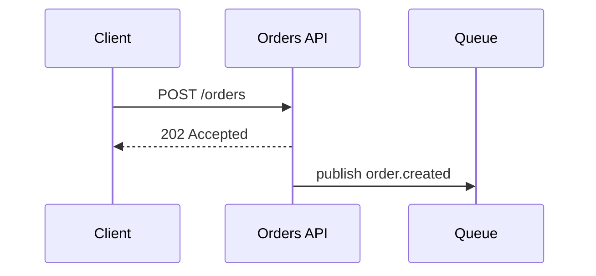
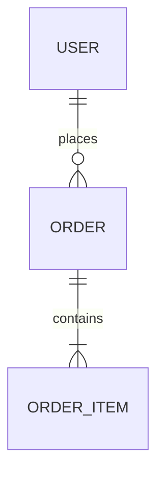
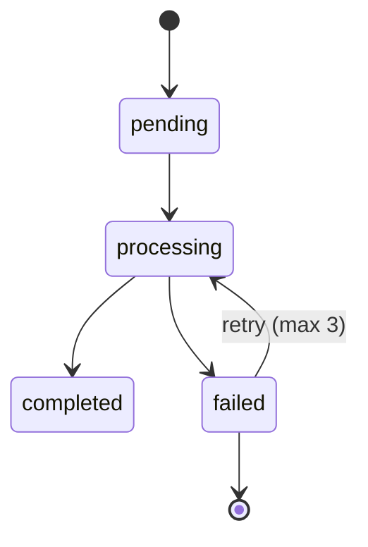

# Diagrams

Read this only when a relationship in the material is genuinely hard to hold in prose. If the
document does not need a diagram, this file is context spent for nothing.

Contents:
- [The invention guard](#the-invention-guard)
- [Does this need a diagram at all](#does-this-need-a-diagram-at-all)
- [Picking the diagram](#picking-the-diagram)
- [Mermaid or ASCII](#mermaid-or-ascii)
- [Per-type guidance](#per-type-guidance)
- [Rendering rules](#rendering-rules)

## The invention guard

A diagram may **simplify** what is known. It may never **invent**: no component, relationship,
cardinality, ordering, dependency or state transition that no source establishes.

This rule is stricter for diagrams than for prose, and the reason is how they are read. Prose can
hedge — "orders appear to belong to a single user" — and the hedge survives. A box with an arrow and
a `1..N` reads as a fact somebody verified, and the reader builds on it. When you find yourself
reaching for a cardinality because it is the usual one, that is the moment the diagram stops being
documentation.

Three legitimate ways out, in order:

1. Leave the unknown part out and note it in prose under the diagram.
2. Label the edge as unverified (`-.->` with a note, or a `?` on the cardinality) so the reader can
   see exactly which part is soft.
3. Drop the diagram and use a table of what is known.

Also honest, and often the right answer: a diagram covering the five confirmed components while the
prose says the remaining two were not established.

## Does this need a diagram at all

Ask what the reader gains that an ordered list does not. Diagrams pay off for **non-linear**
relationships — branching, concurrency, cycles, many-to-many, "these three all talk to that one".

| Material | Better as |
|---|---|
| linear sequence of steps, no branches | numbered list |
| flat list of components | table |
| comparison across options | table |
| configuration keys | table |
| a hierarchy with 3-4 nodes | nested list |
| the same content as an adjacent table | pick one |

A document with six diagrams and no prose is not more visual, it is less readable — each one costs a
context switch. Two or three that carry weight beat six that decorate.

## Picking the diagram

| What the material is | Diagram |
|---|---|
| steps with branches, retries, fallbacks | flowchart |
| messages between actors over time | sequence |
| entities and their relations | ER diagram |
| a lifecycle: statuses and transitions | state diagram |
| components, boundaries, what talks to what | component / architecture |
| what depends on what | dependency graph |
| containment or ownership | tree |
| events over calendar time | timeline |

Signals in the source material that reliably point at each one:

- **flowchart** — "if", "otherwise", "retry", "fallback", "validate", "then", "pipeline"
- **sequence** — client, server, service, request, response, callback, queue, async, event, webhook
- **ER** — entity, table, foreign key, belongs to, 1:N, N:M, owns
- **state** — pending, processing, failed, completed, cancelled, retrying, expired
- **component** — module, service, layer, boundary, adapter, gateway

## Mermaid or ASCII

Default to Mermaid for anything with real structure — it stays editable and renders in most Markdown
viewers.

Use ASCII when the shape is a tree or a small pipeline and the drawing is essentially free:

```
src/
├── api/
├── domain/
│   ├── user/
│   └── payment/
└── infrastructure/
```

A Mermaid graph of a directory tree is strictly worse than that. ASCII also wins when the document
has to survive in plain text — terminal output, a code comment, a paste into a ticket that does not
render Mermaid.

Never hand-draw an ASCII box diagram of anything non-trivial. It is unmaintainable and the first edit
misaligns it.

## Per-type guidance

**Flowchart.** `flowchart TD` for process, `LR` when it is a pipeline. Label every branch edge with
its condition (`-->|invalid|`) — an unlabeled fork tells the reader a decision exists without saying
what decides it. Terminate every path, including the failure ones.



**Sequence.** One participant per real actor, named as the system names them. Solid arrows for calls,
dashed for responses. Only show async as async when a source says it is — turning a synchronous call
into a queue on a diagram is an invented architecture.



**ER.** Only draw the entities whose relations you can source. Cardinality is the highest-risk field
on this diagram — if the source shows a foreign key but nothing about uniqueness, you know there is a
relation and not that it is `1..N`. Say which is which.



**State.** Include the terminal states and the failure transitions; the happy path is rarely the part
that needed a diagram. If the transition that leaves a state is unknown, that gap is the finding.



**Component / architecture.** Group with `subgraph` only where a real boundary exists — a process, a
deployment unit, a network zone. Subgraphs invented for visual tidiness read as architecture. Keep it
under roughly a dozen nodes; past that, split by boundary and draw two.

## Rendering rules

- Put every diagram in a fenced block tagged `mermaid`.
- Keep node labels short; put the explanation in the prose under the diagram.
- Every diagram gets a line of prose saying what to look at. A diagram that has to be interpreted
  unaided is a puzzle.
- The diagram and the text around it must agree. When you edit one, edit the other.
- Quote labels containing spaces, punctuation or reserved words (`end`, `graph`, `class`).
- Re-read the fenced block before delivering: unbalanced brackets, a stray arrow, or a participant
  used before declaration render as an error box, which is worse than no diagram.
