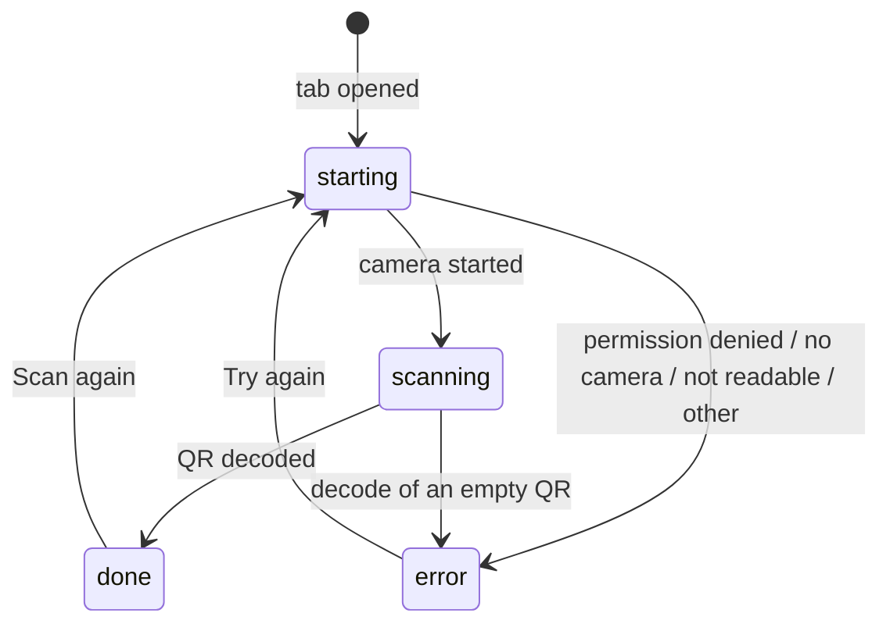
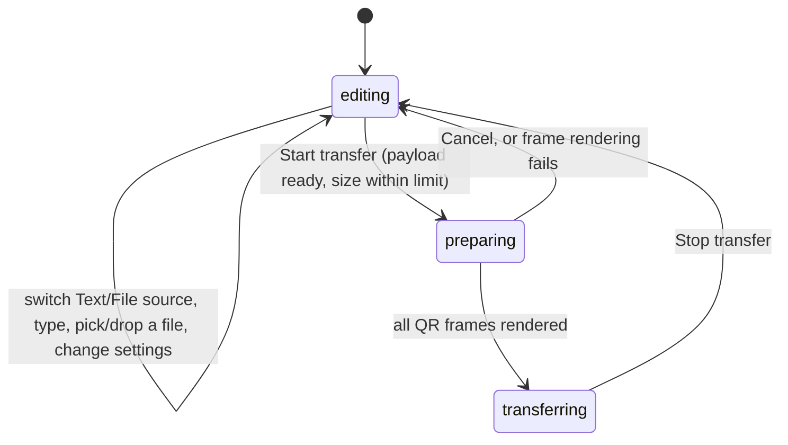
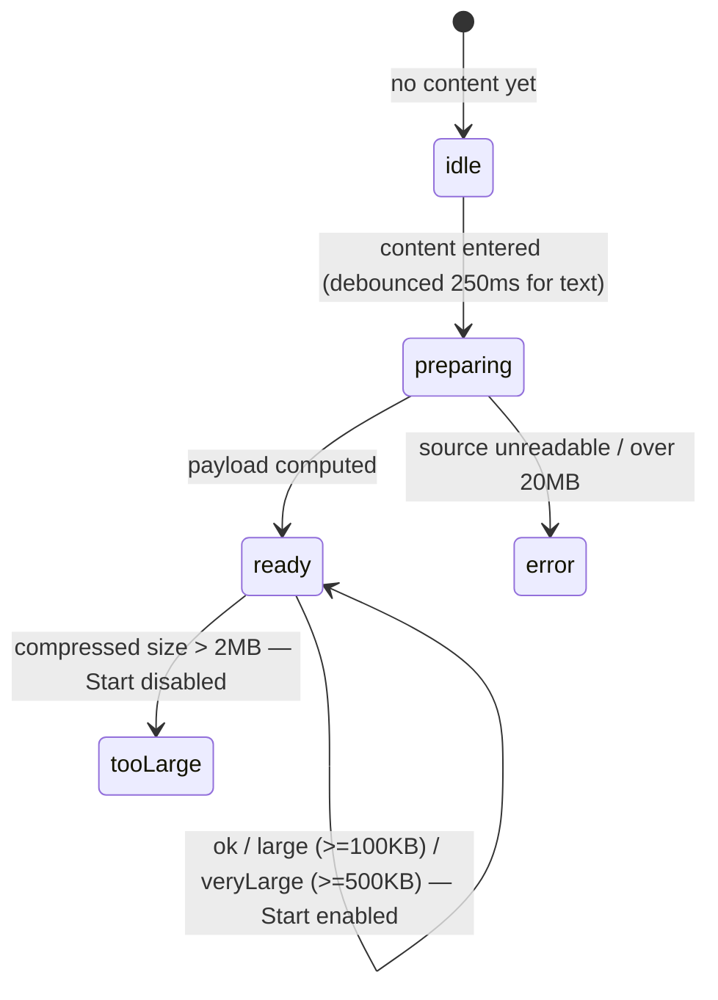
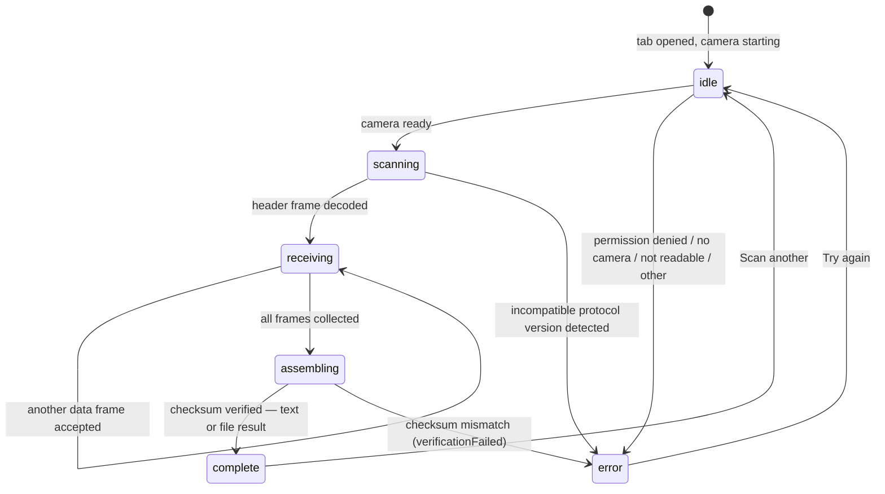

# Flow Diagrams

> The same three flows as state machines, for the shape of the logic rather than its pixels.
> Mirrors the discriminated unions in the code exactly — see the source file noted under each
> diagram if a transition looks surprising.

## Table of Contents

- [Quick QR — Scan](#quick-qr--scan)
- [Large Transfer — Send](#large-transfer--send)
- [Large Transfer — Receive](#large-transfer--receive)

## Quick QR — Scan

Source: `src/components/QRScanner.tsx` (`Status = starting | scanning | done | error`).

## Large Transfer — Send

Source: `src/components/large-transfer/SendFlow.tsx`
(`SenderState = editing | preparing | transferring`). Source/text/file/settings live one level up
in `LargeTransfer.tsx` and survive every transition below, including Stop.

Within `editing`, the summary shown below the composer depends only on payload size — not a
separate top-level state, but worth tracking since it drives whether Start is enabled:

## Large Transfer — Receive

Source: `src/components/large-transfer/useTransferScanner.ts`
(`idle | scanning | receiving | assembling | complete | error`).

