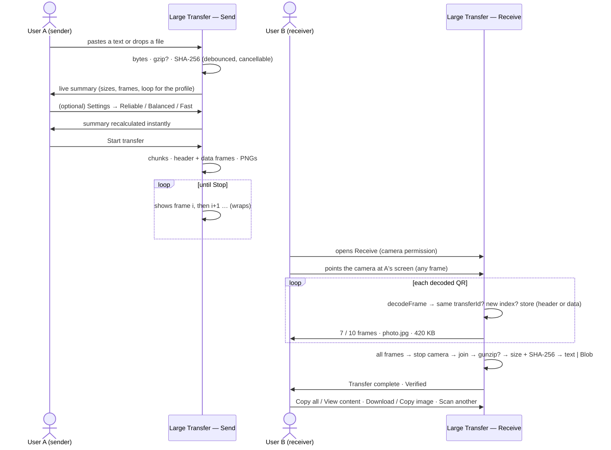

# Large Transfer

> How the **Large Transfer** section moves texts and files of a few KB up to a couple of MB between
> devices using an animated loop of QR codes: pipeline, protocol, profiles, UI states, edge cases
> and tunables. Everything runs client-side; content is never stored or sent over the network.

## Table of Contents

- [Overview](#overview)
- [Goals and Non-Goals](#goals-and-non-goals)
- [Pipeline](#pipeline)
- [Protocol — QRTransfer v2](#protocol--qrtransfer-v2)
- [Transfer Profiles and Settings](#transfer-profiles-and-settings)
- [Sender](#sender)
- [Receiver](#receiver)
- [Flow](#flow)
- [Edge Cases](#edge-cases)
- [Errors](#errors)
- [Limits and Tunables](#limits-and-tunables)
- [Code Layout](#code-layout)
- [Verification](#verification)
- [Not in Scope](#not-in-scope)

## Overview

The **Send** side chooses a source — **Text** (CodeMirror editor) or **File** (drop zone / file
picker, one file per transfer, images get a thumbnail) — sees a live summary (original size,
transfer size, compression, QR frames, estimated loop for the current profile) and presses
**Start transfer**; the frames are rendered and played as a loop. The **Receive** side keeps the
camera on, collects frames in any order, ignores duplicates and other transfers, and finishes
automatically when every frame is present — but only reports success after decompression and the
SHA-256 of the original bytes match. Text is shown/copied; files are downloaded locally (images
also get a preview and, when the Clipboard API allows it, Copy image).

Typical content: plain text, Markdown, JSON, logs, configuration, small PDFs, images, archives,
small binaries. Sweet spot: a few KB to a few hundred KB.

## Goals and Non-Goals

**Goals:** byte-for-byte reproduction of the original text or file; a single binary pipeline for
both; automatic compression decision (already-compressed files travel as-is); works desktop →
phone, phone → desktop, desktop → desktop; frames can be scanned in any order starting anywhere in
the loop; the camera is always released; simple presets instead of technical knobs.

**Non-goals:** it is not a file manager or a network transfer tool; it does not render Markdown or
HTML or interpret/execute file content (files are only wrapped in a `Blob` for download); it does
not persist drafts, files or received content; it does not encrypt (the "channel" is a screen
facing a camera).

## Pipeline

```
TEXT → UTF-8 ─┐
FILE → bytes ─┴→ gzip? (kept only if < 98 % of original) → SHA-256(original) → chunks → frames → PNGs → loop
                                                                                              ↓ camera
TEXT ← UTF-8 decode ┐                                                                         │
FILE ← Blob         ┴← SHA-256 + size check ← gunzip? ← join ← collect/dedupe ← decodeFrame ←─┘
```

- `preparePayload(input)` is the expensive, settings-independent half: read → try gzip
  (`CompressionStream`) → keep it only if it saves ≥ 2 % → SHA-256 of the **original** bytes →
  `{ metadata, bytes, stats }`. It runs (debounced for text) whenever the source changes.
- `buildTransfer(payload, chunkSize)` is cheap and synchronous: splits the transfer bytes at the
  profile's chunk size and encodes header + data frames. Frame count and loop time in the summary
  are derived from it, so changing the profile updates them instantly without re-reading or
  re-hashing.
- Frames are rendered as PNG data URLs (`qrcode`, error correction from the profile, `scale: 6`)
  only when the user presses Start; the animation just swaps `img.src`.
- The receiver scans continuously with `html5-qrcode` (QR-only, native `BarcodeDetector` when
  available), locks onto the first transfer id, ignores other transfers and duplicates, and
  finishes when the header and every data frame are present.

## Protocol — QRTransfer v2

Each QR contains one ASCII string, six fields separated by `|`:

```
header (index 0):    QRT2|<transferId>|0|<total>|H|<metadata>
data   (index ≥ 1):  QRT2|<transferId>|<index>|<total>|D|<payload>
```

| Field        | Description                                                |
| ------------ | ---------------------------------------------------------- |
| `QRT2`       | Magic `QRT` + protocol version `2`                         |
| `transferId` | 8 Base64URL chars, random per transfer (48 bits)           |
| `index`      | 0-based frame index (decimal); `0` is always the header    |
| `total`      | Number of frames **including** the header (decimal, ≥ 2)   |
| `H` / `D`    | Frame kind: header or data                                 |
| `metadata`   | Base64URL of UTF-8 JSON, sent once (see below)             |
| `payload`    | Base64URL (no padding) of this chunk of the transfer bytes |

Header metadata (compact keys, JSON so filenames can contain anything; the whole header stays ASCII):

| Key | Value                                                                    |
| --- | ------------------------------------------------------------------------ |
| `t` | `t` = text, `f` = file                                                   |
| `c` | `g` = gzip, `n` = none                                                   |
| `h` | Full SHA-256 (64 hex) of the **original** bytes (before compression)     |
| `s` | Original size in bytes                                                   |
| `n` | Filename (files only; ≤ 120 UTF-8 bytes, truncated by the sender)        |
| `m` | MIME type (files only; ≤ 100 chars; anything odd becomes `octet-stream`) |

Rules:

- `decodeFrame()` returns `null` for anything malformed (wrong magic/version, `index ≥ total`,
  `total < 2`, data at index 0 / header elsewhere, bad charset, invalid metadata…) — it never
  throws. `detectProtocolVersion()` still recognises `QRT<n>|` prefixes so the receiver can tell
  the user that the sender runs an incompatible version (v1 frames are **not** accepted).
- Within one `transferId`, `total` must be identical in every frame; inconsistent frames are
  ignored. Verification data lives only in the header, which the loop repeats like any frame.
- QR decoders return text, so binary travels as Base64URL (~33 % overhead). Data frames carry ~26
  chars of header + payload; the header frame is small (≈ 200 chars).
- Filenames and MIME types are untrusted: the receiver sanitizes the name (`/`, `\`, control and
  reserved characters → `_`, no leading dots, no empty/reserved names, `..` never becomes a path)
  before offering the download; the MIME type is only used to build the `Blob`.

## Transfer Profiles and Settings

`src/lib/transfer/profiles.ts` centralises the only knobs exposed to users. Measured with `qrcode`
(byte mode) and verified by decoding the rendered PNGs with `html5-qrcode`:

| Profile      | Chunk  | ECC | Frame  | QR (data frame)   | Intent                                                 |
| ------------ | ------ | --- | ------ | ----------------- | ------------------------------------------------------ |
| **Reliable** | 400 B  | Q   | 400 ms | v22 · 105 modules | Larger modules, 25 % recovery; easier to scan, slower  |
| **Balanced** | 750 B  | M   | 300 ms | v26 · 121 modules | Default; same density as the original v1 setup         |
| **Fast**     | 1000 B | L   | 200 ms | v26 · 121 modules | Same density, more data per frame; needs stable camera |

Settings model: `{ profile, frameMs? }` — the profile fixes chunk size, error correction and speed;
**Advanced** exposes only a frame-duration override (500 / 400 / 300 / 250 / 200 ms). Nothing else
(QR version, mask, transfer id, checksum algorithm…) is user-visible. The runtime Slower / Faster
buttons on the transfer screen change the same override; chunk size and ECC cannot change while a
transfer is running (they require re-preparing).

The **preferred profile is the only thing the app persists** (`localStorage`,
`qr-transfer.preferred-profile`); the frame override, drafts, files and received content live only
in memory. Storage failures are ignored.

The settings dialog is a native `<dialog>` (focus trap, Escape, focus returns to the Settings
button), centred on desktop and a bottom sheet under 760 px, with real radio inputs for profiles.

## Sender

States (`SendFlow`): `editing → preparing → transferring` (Stop returns to `editing`, keeping the
text / file / source / settings, which live in `LargeTransfer`).

- **Editing** — `Source [Text | File]` `SegmentedControl` primitive (`role="radiogroup"`).
  - Text: CodeMirror editor with Format `Auto | Text | Markdown | JSON`, Copy, Clear, Fullscreen;
    footer with characters and UTF-8 bytes. Format only changes syntax highlighting. Line-wrap is
    always on. Undo/Redo/Find lost their toolbar buttons in the design-system refactor, but the
    keymaps (Cmd/Ctrl-Z, Cmd/Ctrl-Shift-Z, Cmd/Ctrl-F) are still wired up in `codemirrorSetup.ts`
    and undo history survives the fullscreen toggle (same `EditorView`, never remounted).
  - File: `Dropzone` ("Drop a file here", "Choose file", one file per transfer; extra dropped
    files are ignored with a note) → `FileCard` with name, size, MIME, image thumbnail
    (`URL.createObjectURL`, revoked on change/unmount), Change and Remove.
  - Below: live summary — Filename / Characters, Original size, Transfer size, Compression
    (% or "none"), QR frames, Estimated loop (`frames × frameMs`) with the profile name. From
    100 KB (transfer bytes) a non-blocking "Large transfer" note appears, from 500 KB "Very large
    transfer"; above 2 MB the transfer is refused. Then `[Settings]  [Start transfer]`.
  - Preparation (`usePreparedPayload`) is debounced 250 ms for text, immediate for files, and
    cancels stale work when the source changes or the component unmounts.
- **Preparing** — "Preparing transfer…" while frames are chunked and rendered (yields to the event
  loop every 8 frames; Cancel available).
- **Transferring** — the QR is the dominant element (up to 560 px / most of the viewport width),
  `4 / 10`, "Balanced · Looping every 300 ms", Slower / Faster, Fullscreen (Escape exits) and
  Stop transfer, plus a hint to keep the camera steady and raise screen brightness.

## Receiver

States (`TransferScanner`): `idle` → `scanning` → `receiving` (`7 / 10 frames`, progress bar, and —
once the header arrived — "photo.jpg · 420 KB" or "Text · 21 KB"; missing frames in a collapsed
`<details>`) → `assembling` (camera already stopped) → `complete` | `error`.

- Progress counts **unique** frames (header included), not detections.
- `ChunkCollector` (pure class) stores data chunks by index, keeps the header metadata, locks the
  transfer id, dedupes and reports `missingIndexes` / `isComplete`.
- **Capture** (`src/lib/scan/`): `getUserMedia` → `<video>` → a loop on `requestVideoFrameCallback`
  (falling back to `requestAnimationFrame`). Each frame is cropped and downscaled by a single
  nine-argument `drawImage` onto a canvas sized from `computeRoi` **in camera pixels**, and the RGBA
  buffer is transferred to a worker running ZXing compiled to WebAssembly. One decode is in flight
  at a time; frames arriving meanwhile are skipped before any pixel work is paid for.
- Sizing the canvas ourselves is the point: `html5-qrcode` derives it from the viewfinder's CSS
  width, which left dense symbols at ~3 pixels per module — the floor below which no decoder works.
  The region targets ~4.6.
- The viewfinder is square with `object-fit: cover`, and the guide box is drawn at the same
  `DEFAULT_CROP_RATIO` the crop uses, so the box frames exactly the region being decoded. Each
  accepted frame briefly highlights it in green, fading out on its own.
- `html5-qrcode` remains as an automatic fallback, loaded with a dynamic `import()` only if the
  WASM pipeline fails to start. `?scanner=legacy` forces it; `?debug=1` reports which engine ran.
- **Complete, text** — "Transfer complete", characters, size, "✓ Verified", **Copy all**,
  **View content** (read-only CodeMirror viewer), **Scan another**.
- **Complete, file** — sanitized filename, size, MIME, "✓ Verified", image preview when the MIME is
  `image/*`, **Download** (`<a download>` on a `Blob` object URL, revoked on unmount), **Copy image**
  (only when `navigator.clipboard.write` + `ClipboardItem` exist; non-PNG images are re-encoded to
  PNG via canvas), **Scan another**.
- Cancel / Scan another / Try again restart the session and release the camera; unmounting the
  section releases it too.

## Flow



## Edge Cases

| Case                                             | Behavior                                                                                        |
| ------------------------------------------------ | ----------------------------------------------------------------------------------------------- |
| Frames arrive out of order (`4 5 1 9 2 …`)       | Stored by index; progress is unique frames / total                                              |
| A frame is seen twice                            | Ignored (`duplicate`); progress unchanged                                                       |
| All data frames present but no header yet        | Not complete; `missingIndexes` = `[0]`; next loop supplies it                                   |
| A frame from another transfer appears            | Ignored once a transfer is locked; Cancel/Scan another unlocks                                  |
| Same transfer id but different `total`           | Frame ignored as inconsistent                                                                   |
| Receiver starts mid-loop                         | Works — missing indexes are picked up on the next loop                                          |
| Non-protocol QR (URL, plain text)                | Ignored silently; keeps scanning                                                                |
| `QRT1                                            | …` frame (old sender)                                                                           | Scanner stops with "incompatible version" and Try again |
| Empty text                                       | Start disabled                                                                                  |
| Empty file (0 bytes)                             | Allowed: header + one empty data frame; the receiver downloads an empty, verified file          |
| Already-compressed file (JPG, PNG, ZIP…)         | gzip does not save ≥ 2 % → sent as-is (`c = n`), Compression shows "none"                       |
| Emoji, CJK, accents, `\r\n`, tabs                | Preserved exactly (bytes, not characters, are chunked; strict UTF-8 decoding)                   |
| Unicode / very long / path-like filename         | Truncated to 120 UTF-8 bytes (extension kept) by the sender; sanitized by the receiver          |
| Invalid MIME (`"not a mime"`, empty)             | `application/octet-stream`                                                                      |
| Several files dropped at once                    | The first one is used; a note says so                                                           |
| Content looks like Markdown/JSON/HTML            | Only affects highlighting; shown as source, never rendered or executed                          |
| Transfer bytes ≥ 100 KB / ≥ 500 KB               | Non-blocking "Large" / "Very large transfer — requires N QR frames" note                        |
| Transfer bytes > 2 MB, or source > 20 MB         | Error in the summary; Start disabled (the 20 MB guard avoids reading/gzipping huge files)       |
| Changing profile / frame speed                   | Frames and loop time recalculated instantly; payload, hash and compression untouched            |
| Switching Send ↔ Receive or Text ↔ File          | Draft, file, source and settings are kept; an in-progress loop or scan is stopped, camera freed |
| Escape in fullscreen editor while search is open | Closes the search panel first; a second Escape exits fullscreen                                 |

## Errors

| Condition                                                    | Message                                                        | Action              |
| ------------------------------------------------------------ | -------------------------------------------------------------- | ------------------- |
| Camera permission denied / no camera / busy / generic        | Same messages as Scan QR                                       | Try again           |
| All frames received but size, SHA-256, gunzip or UTF-8 fails | "Transfer could not be verified. Scan again."                  | Try again (rescans) |
| Frame from an incompatible protocol version                  | "This QR comes from an incompatible version of QR Transfer…"   | Try again           |
| Transfer above the technical limit                           | "This content is too large… (limit 1.91 MB after compression)" | Shrink the content  |
| File could not be read                                       | "The file could not be read."                                  | Change file         |

Corrupt or unverified content is never shown as a successful transfer.

## Limits and Tunables

`src/lib/transfer/config.ts` (per-profile values live in `profiles.ts`):

| Constant               | Default                     | Meaning                                             |
| ---------------------- | --------------------------- | --------------------------------------------------- |
| `FRAME_MS_PRESETS`     | 500 / 400 / 300 / 250 / 200 | Speeds selectable at runtime / in Advanced          |
| `MAX_TRANSFER_BYTES`   | 2 000 000                   | Hard limit on bytes that travel (after compression) |
| `MAX_SOURCE_BYTES`     | 20 000 000                  | Guard before reading/compressing a source           |
| `LARGE_BYTES`          | 100 000                     | "Large transfer" note                               |
| `VERY_LARGE_BYTES`     | 500 000                     | "Very large transfer" note                          |
| `COMPRESSION_MIN_GAIN` | 0.98                        | gzip kept only if `compressed < original × 0.98`    |
| `MAX_FILENAME_BYTES`   | 120                         | Filename bytes carried in the header                |
| `MAX_MIME_LENGTH`      | 100                         | MIME length carried in the header                   |

Guidance: if a camera struggles, switch to **Reliable** (or lower a profile's `chunkSize`); if
scanning is reliable, **Fast** halves the loop time. Requires a browser with `CompressionStream`
(Chrome 80+, Safari 16.4+, Firefox 113+) and, for Receive, a secure context (HTTPS or `localhost`).

## Code Layout

- `src/lib/transfer/` — pure logic, no React:
  - `encoding.ts` — UTF-8 (strict decode) and Base64URL.
  - `compression.ts` — `compress` / `decompress` (gzip), `chooseCompression`, `restore`.
  - `chunking.ts` — `splitBytes` / `joinChunks`.
  - `checksum.ts` — full SHA-256 (`computeChecksum`, `verifyChecksum`).
  - `protocol.ts` — `createTransferId`, `encodeFrame`, `decodeFrame`, `detectProtocolVersion`,
    `encodeMetadata` / `decodeMetadata`, `normalizeMimeType`.
  - `filename.ts` — `truncateFilename` (sender), `sanitizeFilename` (receiver).
  - `profiles.ts` — `TRANSFER_PROFILES`, `TransferSettings`, `resolveSettings`.
  - `transfer.ts` — `preparePayload`, `buildTransfer`, `prepareTransfer`, `countFrames`,
    `assembleTransfer`, `ChunkCollector`, `TransferError`.
  - `formatDetection.ts` — conservative JSON / Markdown / text guess for highlighting only.
  - `config.ts`, `types.ts` — tunables, `sizeLevel`, shared types (`TransferInput`,
    `TransferMetadata`, `TransferFrame`, `PreparedPayload`, `PreparedTransfer`, `ReceivedTransfer`).
  - `*.test.ts` — Vitest unit tests next to each module.
- `src/store/preferences.ts` — Zustand `persist` store: theme, language, preferred profile in
  `localStorage` (the only persisted values).
- `src/components/large-transfer/` — UI: `LargeTransfer` (Send/Receive, holds source, draft, file
  and settings), `SendFlow`, `SourceSelector`, `LargeTextEditor` + `codemirrorSetup.ts`,
  `usePreparedPayload.ts`, `TransferSummary`, `TransferSettings`, `AnimatedQR`, `qrFrames.ts`,
  `TransferScanner`, `ReceivedContent`, `ReceivedFile`.
- `src/components/app/{Dropzone,FileCard,SummaryGrid}/` — File-source picker/card and the generic
  key/value grid `TransferSummary` renders into.
- `src/lib/scan/` — receiver capture pipeline, no React:
  - `roi.ts` — `computeRoi` (crop and decode size in camera pixels), `pixelsPerModule`.
  - `captureLoop.ts` — camera, frame loop and pixel handling for the WASM engine.
  - `decoder.worker.ts` / `workerDecoder.ts` — ZXing WASM off the main thread.
  - `readerOptions.ts` — reader options tuned for speed; `singleFlight.ts` — one decode at a time.
  - `engine.ts` — the interface both engines implement; `legacyEngine.ts` — the `html5-qrcode`
    fallback, only ever reached through a dynamic import.
- `src/lib/camera.ts` — camera helpers shared with Quick QR's scanner: `buildVideoConstraints`
  (single source of the camera identity), `buildScanConfig`, `listCameras`, `describeCameraError`,
  `stopScanner`.

## Verification

- `npm test` runs the pure-logic suite: Base64URL/UTF-8 round trips, gzip round trips, the
  compression decision (compressible / random / empty), chunk split/join, checksum, protocol v2
  encode/decode incl. malformed frames and metadata, version detection, MIME normalisation,
  filename truncation and sanitisation, profiles, and end-to-end round trips through the real
  frames: text (ASCII, Spanish, emoji, CJK, multiline, Markdown, JSON, empty, whitespace, ~60 KB),
  files byte-for-byte (text file, PNG-like, random, empty, all-zero, every byte value, Unicode and
  path-like filenames, invalid MIME), shuffled/duplicated/missing frames, missing header, foreign
  ids, inconsistent frames, size/checksum mismatch, tampered gzip and raw bytes, invalid UTF-8;
  and that switching profiles changes frames/loop without touching the payload.
- Browser checks (Chrome, dev server): source selector, live summary for text and files (image
  thumbnail, multi-drop note), Settings dialog (profiles, Advanced, Escape, focus return, bottom
  sheet at 400 px), instant recalculation on profile change, Start → animated loop → Stop keeping
  the file, and a full render-then-decode round trip of every profile with `html5-qrcode`
  (`scanFileV2`) reconstructing a random binary byte-for-byte.
- **Pending manual test:** real screen → camera transfers between two physical devices with the
  three profiles (~20 KB and ~100 KB text, small image, JSON, small binary). If a profile proves
  unreliable, adjust its values in `profiles.ts`.

## Not in Scope

Several files or folders per transfer, automatic ZIP, fountain codes / cross-frame FEC, receiver
acknowledgements or bidirectional communication, encryption or passwords, networking (WebRTC,
WebSockets, relays), concurrent transfers. The versioned protocol leaves room for these.
