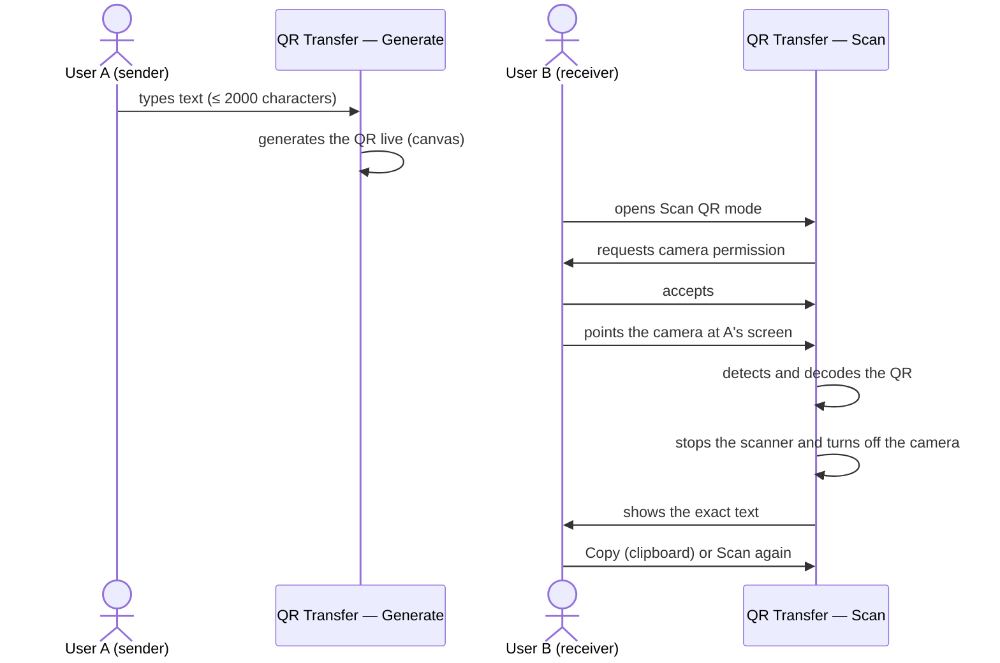

# Text Transfer via QR — Flow

> How transferring text between two devices with QR Transfer works:
> what each end does, which rules apply, and what happens when something fails.

## Table of Contents

- [Overview](#overview)
- [Problem](#problem)
- [Goals](#goals)
- [Non-Goals](#non-goals)
- [Behavior](#behavior)
- [Flow](#flow)
- [Edge Cases](#edge-cases)
- [Errors](#errors)
- [Verification](#verification)
- [Limitations](#limitations)
- [Summary](#summary)

## Overview

A user types text on one device (**Generate QR** mode) and another device reads it with its camera
(**Scan QR** mode). The "transfer" is optical: the QR code is displayed on device A's screen and
device B's camera decodes it. **No data travels over the network or is stored anywhere** — closing
the tab makes the text disappear.

## Problem

Passing a short text between two devices (a key, a note, a URL, a command) usually means sending
it to yourself via email or messaging, which requires accounts, a network connection, and leaves a
copy on a server. QR Transfer solves that case with no intermediaries: all you need is a screen
and a camera.

## Goals

- Transfer text (up to 2000 characters, full Unicode) between two devices with no network.
- The content never leaves each device's browser.
- The receiver gets the text **exactly** as it was typed and can copy it.

## Non-Goals

- It does not transfer files or images — text only.
- It does not interpret the content: a scanned URL is shown as text, not opened.
- It keeps no history and syncs nothing — every transfer is ephemeral.

## Behavior

**Sender side (Generate QR):** the QR code regenerates automatically on every keystroke — there is
no "generate" button. With an empty textarea no QR is shown (just a placeholder). The counter
shows `N / 2000` and turns red at the limit; the textarea accepts no further input. Buttons: copy
the text, clear the field and, on mobile, "Show QR" (scrolls to the QR, which takes up almost the
whole screen to make scanning easier).

**Receiver side (Scan QR):** entering the mode requests camera permission and shows the preview
(back camera by default on mobile; a selector appears when there are multiple cameras). When a QR
is detected: the scanner stops, the camera turns off, and the decoded text is shown as plain text
with **Copy** and **Scan again** buttons. Leaving Scan mode by any path fully releases the camera —
it never stays active in the background.

## Flow

## Edge Cases

| Case                                             | Behavior                                                                                |
| ------------------------------------------------ | --------------------------------------------------------------------------------------- |
| Empty textarea                                   | No QR is generated; a placeholder is shown                                              |
| The 2000-character limit is reached              | Counter turns red with "limit reached"; the textarea blocks further input               |
| Text with many multibyte characters (emoji, CJK) | Can exceed the QR's physical capacity before 2000: an error is shown and there is no QR |
| The QR contains a URL                            | Shown as plain text; never opened or redirected                                         |
| Decoded QR with no text                          | "The QR code does not contain any readable text" message + Try again                    |
| Multiple cameras available                       | Simple selector; back camera by default (`facingMode: environment`)                     |
| Switching tabs (or modes) with the camera on     | The camera stops and the stream is released, even if it was still starting              |
| Switching language with an error on screen       | The error message is translated live                                                    |

## Errors

| Condition                     | Message shown to the user                       | Available action |
| ----------------------------- | ----------------------------------------------- | ---------------- |
| Camera permission denied      | Access denied + how to enable it in the browser | Try again        |
| Device without a camera       | No camera was found                             | Try again        |
| Camera busy in another app    | The camera is not available                     | Try again        |
| Generic startup failure       | The camera could not be started                 | Try again        |
| Text too long for the QR code | The text does not fit in a QR code              | Shorten the text |

Messages are simple and translated (es/en); stack traces are never shown.

## Verification

There are no automated tests: the flow is verified manually (generate with Unicode/emoji, scan
from another device, confirm the text is identical, copy, re-scan, camera shutdown). The repo's
automated checks cover code quality only (`typecheck`, `lint`, `build`). Real scanning between two
physical devices remains a manual test for the user — it has not been verified in this repo's
development environment.

## Limitations

- Both devices must be physically together (screen facing camera).
- Scan mode requires HTTPS in production (secure context for `getUserMedia`).
- Long texts produce dense QR codes, harder to scan with low-quality cameras.
- The transfer is one-directional at a time: to reply, the roles are swapped manually.

## Summary

The transfer is screen → camera, with no network and no storage: A types and their QR is generated
live; B scans, the camera turns itself off, and B receives the exact text, ready to copy. The
rules governing the flow: 2000 characters maximum, content always treated as untrusted plain text,
and the camera released when leaving Scan mode by any path.
