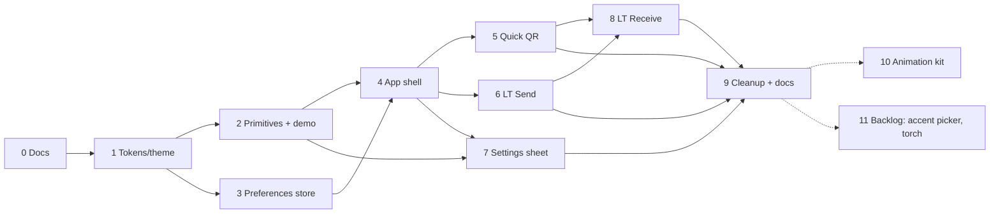

# Macro plan — Design System refactor

Status: **shipped** (Stages 0–10 done, 2026-08-16) · Spec:
[`spec.md`](./spec.md) · Branch: `refactor/design-system` · Started: 2026-08-15

> Execution note: stages land as direct commits on `refactor/design-system`, not one PR per
> stage — the PR-per-stage flow described in §2 was superseded for this working session in favor
> of committing at the end of each completed stage on the single branch.

---

## Table of Contents

1. [Overview](#1-overview)
2. [How to execute this plan](#2-how-to-execute-this-plan)
3. [Ground rules (apply to every stage)](#3-ground-rules-apply-to-every-stage)
4. [Dependency graph](#4-dependency-graph)
5. [Stages](#5-stages)
   - [Stage 0 — Docs & source of truth](#stage-0--docs--source-of-truth)
   - [Stage 1 — Tokens, theme bootstrap, fonts, icons](#stage-1--tokens-theme-bootstrap-fonts-icons)
   - [Stage 2 — Primitives + demo page](#stage-2--primitives--demo-page)
   - [Stage 3 — Preferences store](#stage-3--preferences-store)
   - [Stage 4 — App shell](#stage-4--app-shell)
   - [Stage 5 — Quick QR](#stage-5--quick-qr)
   - [Stage 6 — Large Transfer · Send](#stage-6--large-transfer--send)
   - [Stage 7 — Settings sheet](#stage-7--settings-sheet)
   - [Stage 8 — Large Transfer · Receive](#stage-8--large-transfer--receive)
   - [Stage 9 — Cleanup & final docs](#stage-9--cleanup--final-docs)
   - [Stage 10 — Animation kit (optional)](#stage-10--animation-kit-optional)
   - [Stage 11 — Optional follow-ups](#stage-11--optional-follow-ups)
6. [What we are NOT doing, and why](#6-what-we-are-not-doing-and-why)
7. [Decision log](#7-decision-log)
8. [Risks & mitigations](#8-risks--mitigations)
9. [Tracking](#9-tracking)
10. [Glossary](#10-glossary)

---

## 1. Overview

**What ships when this plan is done**

- A dark-first / light design system with tokens in `src/styles/tokens/`, 12 CSS-Modules
  primitives under `src/components/primitives/`, and a dev-only `?demo=primitives` page.
- The redesigned two-pane shell (compose ↔ optical stage, `100dvh`, one 900 px breakpoint, mobile
  view switcher, header with mode tabs + Send/Receive segmented control + language + theme).
- Every screen rebuilt on the new components: Quick QR send/receive, Large Transfer send,
  settings (native `<dialog>` as modal/sheet, range input), Large Transfer receive with a shared
  viewfinder for both scan engines, verified result panel.
- Theme, language and preferred profile persisted through a Zustand `persist` store (the only
  persistence in the app; never content).
- Inter + JetBrains Mono self-hosted, `lucide-react` icons, CodeMirror re-themed, no remote
  requests, offline intact.
- `src/styles.css` deleted; `DESIGN_SYSTEM.md`, `frontend-architecture.md`, `CLAUDE.md` and the
  screenshot catalog updated to the final state.
- Optional tail: `motion`-based animation kit; accent picker and torch as backlog.

**What does not change**: `src/lib/transfer/**`, `src/lib/scan/**`, protocol v2, profiles,
`SendFlow` / `useTransferScanner` state machines, camera lifecycle, i18n mechanism.

**Size**: 10 stages (+1 optional +1 backlog), one commit each, on `refactor/design-system`. Stages
2/3 and 6/7 can run in parallel; everything else is sequential.

---

## 2. How to execute this plan

This document is written so an agent (or a person) can run it stage by stage without further
design decisions. For **each stage**:

1. Read: this file (§3 + the stage section), `spec.md`, the relevant `DESIGN_SYSTEM.md` sections,
   `frontend-architecture.md`, and `CLAUDE.md`. Look at the prototype
   (`docs/design/prototype/App.dc.html`) only as a visual reference — never copy its inline
   values (they are stale; see spec "Further Notes").
2. Check the stage's **Depends on** row is `done` in §9 Tracking. If not, stop.
3. Set the stage to `in progress` in §9, implement the **Deliverables**, respecting **Constraints**.
4. Run the **Exit criteria** verbatim. All must pass; paste failures into the PR, don't hide them.
5. Update `docs/` listed under **Docs touched**; regenerate screenshots for the listed modules.
6. Commit with the stage's **PR title** as the commit subject (Conventional Commits), directly on
   `refactor/design-system`, set the stage to `done` in §9 with the commit hash.
7. Do not start the next stage in the same commit.

Definition of done for the whole plan: §9 rows 0–9 `done`, `src/styles.css` gone, full
`npm run screenshots` regenerated, all repo checks green on `refactor/design-system`.

---

## 3. Ground rules (apply to every stage)

- **Never** touch `src/lib/transfer/**`, `src/lib/scan/**`, `useTransferScanner.ts` internals,
  `usePreparedPayload.ts`, `useFrameLoop.ts`, `qrFrames.ts`, `codemirrorSetup.ts` semantics, or the
  frame protocol. If a stage seems to need it, stop and raise it.
- **Never** add a network request: no CDN fonts/icons/scripts, no analytics. `npm run build` output
  must be fully offline (grep `dist/` for `https://` if in doubt).
- **Never** persist content. Only `src/store/preferences.ts` (Stage 3+) writes to storage.
- Every user-visible string goes to both `en` and `es` in `src/i18n.ts`. `?demo=primitives` and
  `?debug=1` are exempt (English technical labels).
- Every animation uses motion tokens and is disabled under `prefers-reduced-motion` except the
  QR loop and the progress bar fill.
- No hardcoded hex/px in component CSS: colors, spacing, radius, shadows, durations come from
  tokens. Layout-only numbers (grid fractions, `minmax`) are allowed.
- File conventions per `frontend-architecture.md`: folder-per-component, `Name.tsx` +
  `Name.module.css` + `index.ts`, extra files only when needed; hooks/helpers never in a `.tsx`
  that exports a component.
- Discriminated unions stay; no boolean-flag state.
- Before finishing a stage: `npm run typecheck && npm run lint && npm test && npm run build && npx prettier --check .`
- Old and new UI may coexist **only inside this branch** while stages 4–8 are in flight; each
  stage removes the legacy classes it replaced from `src/styles.css`.

---

## 4. Dependency graph

Parallelizable pairs: **2 ‖ 3**, **6 ‖ 7**. Dotted = optional.

---

## 5. Stages

Each stage: **Goal · Depends on · Deliverables · Constraints · Exit criteria · Docs touched ·
Screenshots · Risk · Size · PR title.**

### Stage 0 — Docs & source of truth

- **Goal**: make `DESIGN_SYSTEM.md` implementable and consistent with the decisions in `spec.md`;
  version the prototype; align the architecture docs.
- **Depends on**: —
- **Deliverables**
  1. `docs/DESIGN_SYSTEM.md` corrected in place, with a `## Changelog (v1 → v1.1)` block at the
     top listing every change:
     - Range tokens → single values: `--fs-ui: 13px/700` (+ `--fs-ui-sm: 12.5px` for dense
       contexts), `--fs-data: 12px/450` (+ `--fs-data-sm: 11px`), `--r-control: 10px`,
       `--r-card: 16px`, `--r-stage: 22px`, `--r-sheet: 24px`, weights fixed per token.
     - Motion: `--duration-fast: 120ms`, `--duration-base: 200ms`, `--duration-sheet: 280ms`,
       `--easing-standard: ease`, `--easing-out: ease-out`; `--anim-*` kept as-is (valid
       `animation` shorthand parts); pulse duration unified at 2 s.
     - Breakpoint: **one**, `900px`; §2.7 rewritten (mobile/tablet tiers removed); §5.12
       "≥760" → "≥900"; `--bp-*` removed from CSS (TS constant `BREAKPOINT_DESKTOP = 900`).
     - Add `color-scheme: dark` / `light` per theme; add `--focus-ring: 2px solid var(--accent)`
       and `--focus-offset: 2px`; add `--cm-*` tokens (10, both themes) mapped onto the palette;
       add light/dark values for `--sh-qr`, `--sh-sheet`; document `--overlay-scrim`/`--scan-mask`
       as intentionally theme-invariant.
     - Token names: DS names are canonical; a table maps the prototype's runtime names
       (`--danger-text`→`--danger`, `--ok-text`→`--ok`, `--warn-text`→`--warn`,
       `--notice-bg/line`→`--warn-bg/line`, `--active-bg`→`--surface-active`).
     - Accessibility fixes: segmented inactive text `--text-faint` → `--text-muted`; light-theme
       primary button adds `border: 1px solid var(--line)`; `--fs-label` never on interactive
       text; §5.7 body uses `--fs-ui-sm` (12.5) not 12px; §5.6/§5.7 raw px snapped to
       `--sp-*`/`--r-*`.
     - Fonts: Satoshi removed → Inter variable (UI) + JetBrains Mono variable (data), self-hosted;
       icons: `iconify-icon` → `lucide-react`; §4.8 lists the 28-icon inventory.
     - §3 Theming: accent fixed to `piedra`; picker moved to "future"; theme/lang persisted via
       store; URL state paragraph removed; §6.2/§6.4 rewritten (no routing).
     - §5.3: editor stays CodeMirror 6 (Large Transfer), plain textarea (Quick QR); toolbar
       Format/Fullscreen/Copy/Clear; search keymap kept; wrap on.
     - §5.12: native `<dialog>` explicitly (prototype's `
` noted as prototype-only).
     - §4: add `Feedback`, `Dialog`, `ProgressBar`, `Spinner` as primitives; remove Skeleton;
       §8 file structure replaced by a pointer to `frontend-architecture.md`.
  2. `docs/design/prototype/{App.dc.html,support.js,README.md}` — README: "visual reference
     only; loads remote fonts/icons; do not copy inline values (stale); the truth is
     `DESIGN_SYSTEM.md`". Remove the `Rediseño de app QR` ignore rule only if that folder is
     deleted; otherwise leave it.
  3. `docs/frontend-architecture.md` amended: CSS Modules + tokens split (unchanged); primitives
     list = 12 from spec; new `src/components/app/`, `src/store/`, `src/lib/theme/`,
     `src/lib/motion/` (optional); "native CSS only" → "CSS for micro-interactions, `motion` for
     layout/presence (Stage 10)"; "incremental migration" → "screen-by-screen rewrite per macro
     plan"; `?demo=primitives` documented; hooks placement rule (co-located with feature, shared
     ones in `src/hooks/` only if used by ≥2 features).
  4. `CLAUDE.md`: Styling section rewritten (tokens, primitives, CSS Modules, breakpoint 900,
     lucide, fontsource, dialog); Architecture: Quick QR IA change (Send/Receive segmented, no
     Generate/Scan tabs); Persistence rule → "only `src/store/preferences.ts` (theme, lang,
     profile) persists — never content"; link to this plan.
  5. `docs/technical-overview.md`: one paragraph + link.
- **Constraints**: no `src/` changes.
- **Exit criteria**: `npx prettier --check docs CLAUDE.md` passes; DS has zero range tokens
  (`grep -nE '[0-9]+(\.[0-9]+)?–[0-9]' docs/DESIGN_SYSTEM.md` returns nothing in token tables);
  every token used in DS §4–§5 is defined in §2 (manual check); links resolve.
- **Docs touched**: all of the above. **Screenshots**: none.
- **Risk**: low. **Size**: S (docs only). **PR title**: `docs(design-system): correct DS v1.1, version prototype, align architecture docs`

### Stage 1 — Tokens, theme bootstrap, fonts, icons

- **Goal**: the token layer, theme switching infra, fonts and icon library exist and the _current_
  UI still renders unchanged on top of them.
- **Depends on**: 0
- **Deliverables**
  1. `src/styles/tokens/{colors,typography,spacing,radius,shadows,motion,z}.css` with the DS v1.1
     values; dark on `:root`, light on `:root[data-theme='light']`, `color-scheme` per theme;
     `src/styles/base.css` (reset, `body`, fonts), `src/styles/layout.css` (empty shell rules for
     now), `src/styles/index.css` importing them in order and — temporarily — `../styles.css`.
  2. **Bridge**: at the end of `src/styles/index.css`, a `:root { --bg: var(--bg); … }` block is
     unnecessary; instead rewrite the old `:root` blocks in `styles.css` to alias legacy names to
     new tokens (`--surface-muted: var(--surface-2)`, `--hover: var(--surface-active)`,
     `--focus: var(--accent)`, `--primary: var(--accent)`, `--primary-text: var(--on-accent)`,
     `--cm-*` → new `--cm-*`). Old components keep working; visual drift is expected and accepted.
  3. `index.html`: inline `<script>` that reads the persisted theme (key `qr-transfer:prefs`, or
     `prefers-color-scheme` fallback) and sets `data-theme` before paint. `App.tsx` keeps setting
     `data-theme` from state (until Stage 3 moves it to the store).
  4. `src/lib/theme/`: `contrast.ts` (`relativeLuminance`, `contrastRatio`, `bestOnColor`) +
     tests; `accent.ts` (single `ACCENT = piedra` object, `applyAccent(root)` writing `--accent*`
     - `--on-accent`); `breakpoints.ts` (`BREAKPOINT_DESKTOP = 900`).
  5. Fonts: `@fontsource-variable/inter`, `@fontsource-variable/jetbrains-mono` imported in
     `base.css`; `font-display: swap`; preload of the two woff2 in `index.html`.
  6. `lucide-react` installed; `src/components/primitives/Icon/` **not yet** (Stage 2) — only the
     dependency.
  7. `src/main.tsx` imports `src/styles/index.css` instead of `styles.css`.
- **Constraints**: no visual redesign of components yet; no new components; bundle contains no
  external URLs.
- **Exit criteria**: repo checks green; `grep -R "https://" dist/assets | grep -v "w3.org\|sourceMappingURL"` empty; app renders in both themes with no console errors; `src/lib/theme/contrast.test.ts` asserts `bestOnColor('#AAAAAD') === '#050505'` and ratios for the DS contrast table; `npm run screenshots -- --only 00` runs.
- **Docs touched**: `frontend-architecture.md` (token files exist now). **Screenshots**: `00`.
- **Risk**: medium (font/preload wiring, alias mistakes). **Size**: M. **PR title**: `feat(styles): design tokens, theme bootstrap, self-hosted fonts, lucide`

### Stage 2 — Primitives + demo page

- **Goal**: all 12 primitives implemented, themed, accessible, and reviewable on one page.
- **Depends on**: 1
- **Deliverables** (`src/components/primitives/<Name>/…`, CSS Modules, tokens only)
  - `Button` — variants `primary | secondary | destructive`; sizes `md 42 | sm 38 | icon 34`;
    `iconLeft/iconRight`; `loading` (renders `Spinner`); disabled tokens; light-theme primary
    border; 44 px touch target via pseudo-element on icon size.
  - `Input` — `Textarea`, `Select`, `Range` surfaces sharing focus ring/placeholder tokens
    (`Input.tsx` + subcomponents folder).
  - `SegmentedControl` — `role="radiogroup"`/`aria-checked`, keyboard arrows, active =
    `--surface-active` + `--text-strong`, inactive `--text-muted`.
  - `Tabs` — underline style, `aria-current`, uppercase `--fs-label` label variant.
  - `StatusDot` — `live` prop → pulse (reduced-motion safe).
  - `Chip` — `--fs-data`, optional `onRemove`.
  - `Card` — `padding` scale prop, `dashed` variant (dropzone), `radius: control|card|stage`.
  - `Icon` — thin wrapper: `name` typed to the 28-icon inventory (`Icon.constants.ts`), sizes
    `14|16|22|26`, `currentColor`.
  - `Feedback` — `level: notice | error | verified`, icon + title + body + optional actions,
    `role="status"`/`"alert"` by level.
  - `Dialog` — wraps `<dialog>` + `showModal`; `variant: modal | sheet` auto by
    `BREAKPOINT_DESKTOP` (hook `useIsDesktop` in `Dialog/useIsDesktop.ts`); backdrop scrim+blur;
    `@starting-style` enter, `prefers-reduced-motion` off; focus restore; `Dialog.Header/Body/Footer`.
  - `ProgressBar` — 8 px pill, `value/max`, `aria-valuenow`, label slot.
  - `Spinner` — `--anim-spin`, sizes, `aria-label`.
  - `src/components/demo/PrimitivesDemo.tsx` (lazy) mounted by `App` when
    `location.search` has `demo=primitives` (same detection helper as `debug`); grid of every
    primitive × variant × state, theme toggle, reduced-motion toggle.
  - Screenshot script: new module `05-primitives` capturing the demo page desktop/mobile ×
    light/dark.
- **Constraints**: no app component uses primitives yet (that starts in Stage 4); demo excluded
  from main chunk; no i18n keys for demo.
- **Exit criteria**: repo checks green; demo renders every primitive without console errors;
  keyboard: Tab order and focus ring visible on each; `Dialog` traps focus and closes on Escape;
  `npm run screenshots -- --only 05` produces the module; unit tests for any `.utils.ts`.
- **Docs touched**: `frontend-architecture.md` (primitives inventory = shipped), `docs/design/README.md` (module 05). **Screenshots**: `05`.
- **Risk**: medium (Dialog sheet/modal + `@starting-style`). **Size**: L. **PR title**: `feat(primitives): design-system primitives and ?demo=primitives page`

### Stage 3 — Preferences store

- **Goal**: theme, language and preferred profile persist through one Zustand store.
- **Depends on**: 1 (parallel with 2)
- **Deliverables**
  1. `zustand` installed. `src/store/preferences.ts`: `{ theme: 'dark'|'light', lang: 'en'|'es',
profile: TransferProfileId, setTheme, setLang, setProfile }`, `persist` middleware, key
     `qr-transfer:prefs`, `version: 1`, `migrate` reading the legacy `settingsStorage` key once
     and deleting it; initial theme/lang from `prefers-color-scheme` / `navigator.language` when
     nothing is stored.
  2. `App.tsx` reads/writes theme + lang from the store; `LargeTransfer.tsx` reads/writes profile
     from the store; `src/lib/settingsStorage.ts` deleted.
  3. `index.html` inline script reads the same key (shape documented in a comment in the store).
  4. `src/store/preferences.test.ts` (mock `localStorage`): persisted shape, migration from legacy
     key, no content fields.
- **Constraints**: nothing else goes in the store; no content, ever.
- **Exit criteria**: repo checks green; reload keeps theme/lang/profile; legacy key migrated;
  storage contains exactly `{state:{theme,lang,profile},version:1}`.
- **Docs touched**: `CLAUDE.md` persistence rule (already worded in Stage 0; verify), `technical-overview.md` "Almost no persistence" bullet. **Screenshots**: none.
- **Risk**: low. **Size**: S. **PR title**: `feat(store): persist theme, language and profile with zustand`

### Stage 4 — App shell

- **Goal**: the two-pane shell with the new header, context label and mobile view switcher, hosting
  the _existing_ screens unchanged inside its panes.
- **Depends on**: 2, 3
- **Deliverables**
  1. `src/components/app/AppHeader/` — logo mark, `Tabs` (Quick QR / Large Transfer),
     `SegmentedControl` Send/Receive (shared by both modes), lang button, theme button
     (`Icon sun/moon`). `NavMenu.tsx`, `ModeTabs.tsx` deleted; `App.tsx` owns `mode` + `role`
     (`role` lifted from `LargeTransfer` and applied to Quick QR too: send=Generate,
     receive=Scan).
  2. `src/components/app/AppShell/` — `100dvh` column: header · body grid `1.35fr / minmax(400px,
560px)` at ≥900, single column below; `ContextLabel` (`StatusDot` + `--fs-label` line,
     ellipsis) at top of the compose pane; `MobileViewSwitcher` (fixed bottom bar, `compose |
stage`, safe-area) below 900; `useIsDesktop` from Stage 2. Panes expose `compose` and `stage`
     slots; each screen decides what goes where (Stage 5–8). Until then Quick QR/Large Transfer
     render entirely in the compose slot.
  3. Layout rules in `src/styles/layout.css` (shell only); legacy `.app`, `.header`, `.nav*`,
     `.tabs` rules removed from `styles.css`.
  4. i18n keys: context label templates (`ctxQuick`, `ctxLarge`, `roleSend`, `roleReceive`,
     `limitChars(n)`, `srcText/srcFile`), `viewCompose`, `viewStage`.
- **Constraints**: no page scroll at any width ≥ 360 px; screens keep working even though they are
  not restyled yet.
- **Exit criteria**: repo checks green; `document.documentElement.scrollHeight === innerHeight` at
  1280×800 and 390×844 in the empty states; switcher only below 900; Send/Receive toggles Quick
  QR generate/scan and Large Transfer send/receive; `npm run screenshots -- --only 00`.
- **Docs touched**: `docs/design/flows/app-shell.md` (rewrite for new shell). **Screenshots**: `00`.
- **Risk**: high (state lift, layout height math, all screens affected). **Size**: L. **PR title**: `feat(shell): two-pane app shell, header with mode tabs and send/receive control`

### Stage 5 — Quick QR

- **Goal**: Quick QR send/receive on the new components and panes.
- **Depends on**: 4
- **Deliverables**
  1. Send: `components/app/TextEditor/` in `plain` mode (Card, header row `--fs-label` title +
     Copy/Clear buttons, textarea `--font-mono`, footer counter + limit warning `--warn`), stage =
     `components/app/OpticalStage/QrDisplay/` with `empty` (dashed inner card, `qr-code` icon,
     placeholder) and `ready` (white `--qr-paper` card, `--qr-quiet`, `--sh-qr`, canvas 640 px
     scaled to `min(46vh,300px)`, caption). Mobile: primary "Show QR" switches to the stage pane.
  2. Receive: `components/app/OpticalStage/CameraScanner/` chrome (Card `--r-stage`, camera
     `Select`, viewfinder with corner brackets `--scan-guide`, sweep line, starting overlay with
     `Spinner`, live badge `StatusDot` + label, hint) wrapping the existing `html5-qrcode`
     lifecycle from `QRScanner.tsx`; result via `components/app/ResultPanel/` (`Feedback
verified` + text + Copy / Scan again).
  3. `QRGenerator.tsx`, `QRScanner.tsx` replaced/thinned; `CopyButton` becomes `Button` with a
     `useCopy` hook (`src/hooks/useCopy.ts`, shared later by receive).
  4. Legacy `.qr-*`, `.scanner*`, `.counter*` rules removed from `styles.css`.
- **Constraints**: camera lifecycle pattern preserved verbatim (`finished` flag, `session`
  counter, `stopScanner()` in cleanup).
- **Exit criteria**: repo checks green; camera manual check (start/stop/permission denied); QR
  decodes from another device in both themes; `npm run screenshots -- --only 10,20`.
- **Docs touched**: `docs/design/flows/quick-qr.md`. **Screenshots**: `10`, `20`.
- **Risk**: medium. **Size**: M. **PR title**: `feat(quick-qr): redesign generate/scan on the new shell`

### Stage 6 — Large Transfer · Send

- **Goal**: compose pane (editor / dropzone / file card / feedback / summary / actions) and QR
  stage (loop, speed, fullscreen) on the new components.
- **Depends on**: 4 (parallel with 7)
- **Deliverables**
  1. `TextEditor` in `code` mode: CodeMirror 6 mounted inside the Card body; toolbar = Format
     `Select`, Fullscreen `Button icon`, Copy, Clear; Undo/Redo/Find/Wrap buttons removed;
     `search` keymap kept; wrap on by default; CodeMirror theme reads `--cm-*` tokens; fullscreen
     stays a class on the same wrapper. Footer: `chars · KB` in `--fs-data`.
  2. `SourceSelector` → `SegmentedControl` Text/File in the context-label row.
  3. `components/app/Dropzone/` (Card dashed, `file-up` icon, title, hint, primary Choose file;
     drag-over accent border), `components/app/FileCard/` (thumb box, name, meta, Change
     secondary, Remove icon), multi-drop → `Feedback notice`.
  4. `components/app/SummaryGrid/` — CSS grid `auto-fit minmax(112px,1fr)`, hairline dividers,
     6 cells from existing `TransferSummary` values; size-tier messages → `Feedback notice`,
     too-large → `Feedback error` + Start disabled.
  5. Actions row: Settings `Button secondary` (`sliders-horizontal` + profile name) + Start
     transfer `Button primary` (`play`), Cancel while preparing (`Spinner` in button).
  6. `QrDisplay` `looping` state: frame counter caption, Slower/Faster, Fullscreen/Stop, hint;
     `fullscreen` overlay (`--z-fullscreen`, white, exit pill). Reuses `useFrameLoop`,
     `qrFrames.ts`, `AnimatedQR` logic (component rewritten, hooks untouched).
  7. Legacy `.editor*`, `.dropzone*`, `.file-*`, `.summary*`, `.transfer*`, `.speed*` removed.
- **Constraints**: `SendFlow` union unchanged; `usePreparedPayload` untouched; no per-frame work
  added to the loop.
- **Exit criteria**: repo checks green; Markdown/JSON highlighting visible in both themes; Cmd/
  Ctrl-F opens search; fullscreen keeps undo history; loop runs at profile speed; `npm run
screenshots -- --only 30,50`.
- **Docs touched**: `docs/design/flows/large-transfer-send.md`, `docs/large-transfer.md` (toolbar note). **Screenshots**: `30`, `50`.
- **Risk**: medium-high (CodeMirror theming, height in `100dvh`). **Size**: L. **PR title**: `feat(large-transfer): redesign send flow — editor, file source, summary, QR stage`

### Stage 7 — Settings sheet

- **Goal**: settings as `Dialog` (modal ≥900 / sheet <900) with profile radio cards and a range
  slider.
- **Depends on**: 2, 4 (parallel with 6)
- **Deliverables**: `components/app/SettingsSheet/` using `Dialog`; `ProfileOption` (custom radio
  17 px, name + mono spec "300 ms · 550 B · EC M", description; active border accent); Advanced
  disclosure with `Input.Range` snapping to `FRAME_MS_PRESETS`; footer Reset (secondary) + Done
  (primary); profile change writes the store. `TransferSettings.tsx` replaced; legacy `.dialog*`,
  `.profile-*` removed.
- **Constraints**: native `<dialog>` semantics; profiles remain the only knobs; no new numbers in
  the component (spec string built from `profiles.ts`).
- **Exit criteria**: repo checks green; Escape closes and focus returns to the trigger; sheet has
  safe-area padding; range emits only preset values; `npm run screenshots -- --only 40`.
- **Docs touched**: `docs/design/flows/large-transfer-send.md` (settings section). **Screenshots**: `40`.
- **Risk**: low-medium. **Size**: S-M. **PR title**: `feat(settings): dialog/sheet with profile cards and frame-duration range`

### Stage 8 — Large Transfer · Receive

- **Goal**: receive flow on the new components with one viewfinder for both engines.
- **Depends on**: 5, 6
- **Deliverables**
  1. `CameraScanner` (from Stage 5) hosts the Large Transfer engines: the WASM guide box and the
     legacy fallback render the same brackets/sweep/badge; badge shows `live` / `NN %` while
     receiving; `.scan-guide-hit` flash preserved (reduced-motion off).
  2. `components/app/ReceiveStatusPanel/` — Card, header row (status `Icon` per state + title +
     right meta `--fs-data`), body copy, progress sub-block (`ProgressBar` + frame count + label,
     "Missing frames" disclosure with `Chip` list, `max-height` 96 px scroll), `aria-live="polite"`.
     States map 1:1 to `useTransferScanner` union.
  3. `ResultPanel` (from Stage 5) extended: `Feedback verified` header + metadata, scrollable
     mono body / image preview / file row, footer Copy all | Download + Scan another; Copy image
     when supported.
  4. Errors: `Feedback error` with action row differing by recoverability (Try again vs. none).
  5. `TransferScanner.tsx`, `ReceiveProgress.tsx`, `ReceivedContent.tsx`, `ReceivedFile.tsx`
     rewritten as thin renderers; `useTransferScanner.ts` **unchanged**. Legacy `.camera*`,
     `.scan-*`, `.progress*`, `.received*`, `.stats*` removed.
- **Constraints**: canvas sizing in camera pixels untouched; single decode in flight untouched;
  filename/MIME sanitizing untouched.
- **Exit criteria**: repo checks green; end-to-end transfer text + image + PDF verified on a
  phone (Android and iOS) in both engines (`?scanner=legacy`); tab switch mid-scan releases the
  camera; `npm run screenshots -- --only 60,70` (fake camera).
- **Docs touched**: `docs/design/flows/large-transfer-receive.md`, `docs/large-transfer.md` (viewfinder note). **Screenshots**: `60`, `70`.
- **Risk**: high (camera, two engines, fake-camera screenshots). **Size**: L. **PR title**: `feat(large-transfer): redesign receive flow — shared viewfinder, status and result panels`

### Stage 9 — Cleanup & final docs

- **Goal**: no legacy left; docs and catalog reflect the shipped state.
- **Depends on**: 5, 6, 7, 8
- **Deliverables**: delete `src/styles.css` and the bridge aliases; grep for unused CSS classes /
  dead components / unused i18n keys and remove; `docs/design/components.md` regenerated against
  primitives; full `npm run screenshots`; `docs/design/README.md` coverage table updated;
  `frontend-architecture.md` and `CLAUDE.md` final pass; `technical-overview.md` "Theming" and
  "Responsive layout" bullets rewritten; §9 tracking closed; `spec.md` status → shipped.
- **Exit criteria**: repo checks green; `grep -rn "styles.css" src index.html` empty; bundle has
  no external URLs; catalog regenerated with 0 failures.
- **Risk**: low. **Size**: S-M. **PR title**: `chore(design-system): remove legacy stylesheet, refresh catalog and docs`

### Stage 10 — Animation kit (optional)

- **Goal**: richer layout/presence transitions with `motion`, opt-in per component.
- **Depends on**: 9
- **Deliverables**: `motion` installed (`motion/react`, prefer `motion/mini` primitives where
  enough); `src/lib/motion/` — `presets.ts` (`fadeSlideUp`, `sheetEnter`, `paneSwitch`,
  `staggerList`, `presence`), `reducedMotion.ts` (`useReducedMotion` gate → instant variants);
  adopted in: pane switch (mobile), `Dialog` enter/exit (replacing `@starting-style` path or
  layered on it), `Feedback` presence, `SummaryGrid` stagger, result panel enter. Bundle delta
  documented in the PR. `frontend-architecture.md` motion section updated; `DESIGN_SYSTEM.md`
  §2.6 lists which transitions are CSS and which are `motion`.
- **Constraints**: never on the QR loop, viewfinder, or progress fill; every preset collapses to
  no motion under reduced-motion; no animation on first paint of the compose pane.
- **Exit criteria**: repo checks green; bundle delta ≤ 20 KB gz; screenshots stable (animations
  disabled in the capture script as today).
- **Risk**: low. **Size**: M. **PR title**: `feat(motion): animation kit on motion for pane, dialog and feedback transitions`

### Stage 11 — Optional follow-ups

Backlog, not scheduled. Each is its own small spec if picked up.

- **Accent picker** — header swatches from the prototype; requires per-accent light-theme fill
  fix and i18n names; store field `accent`.
- **Torch** — `MediaStreamTrack.applyConstraints({advanced:[{torch:true}]})` behind capability
  check; hidden when unsupported (iOS Safari).
- **Spanish pass of the screenshot catalog** and re-enabling dropped micro-states.

---

## 6. What we are NOT doing, and why

- **URL routing** — nothing in the product needs deep links; `phase` can't be restored (camera);
  keeping state in memory avoids a new layer. Prototype uses the URL only as its QA screen
  catalog.
- **Satoshi** — license forbids self-hosting; remote loading breaks offline. Inter is the shipped
  UI face; if ITF permission is ever obtained it's one `@font-face` swap.
- **`iconify-icon`** — runtime CDN fetch. `lucide-react` is offline by construction.
- **Tailwind / CSS-in-JS / Radix / Storybook** — out of proportion for the app size; CSS Modules
  - tokens cover the need. Radix stays a per-primitive escape hatch (unused).
- **Plain `<textarea>` for Large Transfer** — drops highlighting/search that users have; CodeMirror
  is themed instead.
- **Accent picker & torch in v1** — product surface + contrast/compat problems; backlog.
- **Skeleton** — no screen uses it.
- **Landing page** — out of scope of the app.

---

## 7. Decision log

| #   | Decision                                                 | Why                                                                 | Where      |
| --- | -------------------------------------------------------- | ------------------------------------------------------------------- | ---------- |
| D1  | Full redesign, screen-by-screen on one branch            | Two visual languages otherwise; DS is grounded in a prototype       | spec       |
| D2  | Quick QR direction = header Send/Receive segmented       | Prototype IA; one shell for both modes                              | Stage 4    |
| D3  | One breakpoint, 900 px                                   | Prototype uses one; two-pane fits from 900; sheet below             | Stage 0/4  |
| D4  | Dark on `:root`, light override, inline pre-paint script | DS convention; avoid theme flash                                    | Stage 1    |
| D5  | Fixed accent `piedra`, light-theme primary border        | 4/5 accents fail 3:1 fill on light; picker → backlog                | Stage 0/2  |
| D6  | Inter + JetBrains Mono via fontsource                    | Satoshi license; offline                                            | Stage 1    |
| D7  | `lucide-react`                                           | Offline, tree-shaken, React 19                                      | Stage 1/2  |
| D8  | CSS Modules + tokens; folder-per-component               | Scoped, zero deps, matches architecture doc                         | Stage 2+   |
| D9  | CodeMirror stays; toolbar reduced; search keymap kept    | Keep highlighting/search; declutter per DS                          | Stage 6    |
| D10 | Native `<dialog>` for settings                           | A11y for free; prototype `
` was prototype-only                 | Stage 7    |
| D11 | Zustand `persist` for theme/lang/profile only            | User request; single persistence point; never content               | Stage 3    |
| D12 | No routing                                               | Unnecessary; `phase` not restorable                                 | §6         |
| D13 | Native CSS motion first, `motion` kit as late opt-in     | Primitives don't need a runtime; kit adds layout/presence polish    | Stage 2/10 |
| D14 | `?demo=primitives` page instead of Storybook             | Zero deps; captured by the screenshot script                        | Stage 2    |
| D15 | Prototype versioned under `docs/design/prototype/`       | Visual reference; inline values are stale so it's not a code source | Stage 0    |
| D16 | Macro plan/spec in English                               | User choice; DS and architecture docs are English                   | —          |

---

## 8. Risks & mitigations

| Risk                                                   | Stage | Mitigation                                                                                  |
| ------------------------------------------------------ | ----- | ------------------------------------------------------------------------------------------- |
| `100dvh` shell breaks on iOS toolbars / keyboard       | 4     | `dvh` + `env(safe-area-inset-*)`; test on iOS Safari early in Stage 4; fallback `svh`       |
| CodeMirror height inside a fixed-height pane           | 6     | `.cm-editor{height:100%}` + `.cm-scroller{overflow:auto}`; verify fullscreen path           |
| Camera lifecycle regressions while rewriting renderers | 5, 8  | Hooks untouched; manual matrix (start/stop/tab switch/permission/fallback) in exit criteria |
| Theme flash on load                                    | 1     | Inline script reads store key before paint; screenshot both themes at first paint           |
| Font files inflate bundle                              | 1     | Variable fonts, latin subset only, preload two files; check `dist` size in PR               |
| Fake-camera screenshots break with new viewfinder      | 8     | Keep the ROI/decode canvas untouched; only chrome changes; re-run `--only 60,70`            |
| Legacy/new CSS collide mid-branch                      | 4–8   | Each stage deletes the classes it replaces; bridge aliases removed in Stage 9               |
| `@starting-style` support                              | 2     | Progressive: dialog works without animation where unsupported; Stage 10 can layer `motion`  |

---

## 9. Tracking

States: `pending` · `in progress` · `done` · `blocked` · `skipped`

| #   | Stage                                  | Depends on | Risk     | Size | Status  | Commit    | Exit check                                                                                                      |
| --- | -------------------------------------- | ---------- | -------- | ---- | ------- | --------- | --------------------------------------------------------------------------------------------------------------- |
| 0   | Docs & source of truth                 | —          | low      | S    | done    | `cc63318` | DS v1.1 consistent; prototype versioned; docs aligned                                                           |
| 1   | Tokens, theme bootstrap, fonts, icons  | 0          | medium   | M    | done    | `f4a1257` | Offline bundle; no flash; contrast tests green                                                                  |
| 2   | Primitives + demo page                 | 1          | medium   | L    | done    | `b8f8c52` | 12 primitives on `?demo=primitives`; module 05 captured                                                         |
| 3   | Preferences store                      | 1          | low      | S    | done    | `0c71959` | theme/lang/profile survive reload; legacy key migrated                                                          |
| 4   | App shell                              | 2, 3       | high     | L    | done    | `03ec5aa` | No page scroll; switcher <900; Send/Receive drives both modes                                                   |
| 5   | Quick QR                               | 4          | medium   | M    | done    | `4d2b45d` | Generate/scan restyled; camera matrix OK; modules 10/20                                                         |
| 6   | Large Transfer · Send                  | 4          | med-high | L    | done    | `4074d5e` | CodeMirror themed; summary grid; loop/fullscreen; modules 30/50                                                 |
| 7   | Settings sheet                         | 2, 4       | low-med  | S-M  | done    | `b68e086` | Dialog modal/sheet; range presets; module 40                                                                    |
| 8   | Large Transfer · Receive               | 5, 6       | high     | L    | done    | `8346152` | Shared viewfinder both engines; modules 60/70 green; phone E2E not verifiable in this environment (see journal) |
| 9   | Cleanup & final docs                   | 5–8        | low      | S-M  | done    | `84629aa` | `styles.css` gone; full catalog; docs final                                                                     |
| 10  | Animation kit (optional)               | 9          | low      | M    | done    | `863f6fd` | Presets adopted; +14.97 KB gz (≤20 KB); reduced-motion safe; 242/242 screenshots                                |
| 11  | Backlog: accent picker, torch, ES pass | 9          | —        | —    | pending |           | Separate mini-specs                                                                                             |

### Stage journal

| Date       | Stage | Note                                                                                                                                                                                                                                                                                                                                                                                                                                                                                                                                                                                                                                                                                                                                                                                                                                                                                                                                                                                                                                                                                                                                                                                                                                                                                                                                                                                                                                                                                                                                                                                                                                                                                                                                                                                                                                                                                                                                                                                                                                                                                                                                                                                                                                                                                                                                                                                                                                                                                                                                                                                                                                                                                                                                                                                                                                                                                                                                                                                                                                                                                                                                                                                                                                                                                                                                  |
| ---------- | ----- | ------------------------------------------------------------------------------------------------------------------------------------------------------------------------------------------------------------------------------------------------------------------------------------------------------------------------------------------------------------------------------------------------------------------------------------------------------------------------------------------------------------------------------------------------------------------------------------------------------------------------------------------------------------------------------------------------------------------------------------------------------------------------------------------------------------------------------------------------------------------------------------------------------------------------------------------------------------------------------------------------------------------------------------------------------------------------------------------------------------------------------------------------------------------------------------------------------------------------------------------------------------------------------------------------------------------------------------------------------------------------------------------------------------------------------------------------------------------------------------------------------------------------------------------------------------------------------------------------------------------------------------------------------------------------------------------------------------------------------------------------------------------------------------------------------------------------------------------------------------------------------------------------------------------------------------------------------------------------------------------------------------------------------------------------------------------------------------------------------------------------------------------------------------------------------------------------------------------------------------------------------------------------------------------------------------------------------------------------------------------------------------------------------------------------------------------------------------------------------------------------------------------------------------------------------------------------------------------------------------------------------------------------------------------------------------------------------------------------------------------------------------------------------------------------------------------------------------------------------------------------------------------------------------------------------------------------------------------------------------------------------------------------------------------------------------------------------------------------------------------------------------------------------------------------------------------------------------------------------------------------------------------------------------------------------------------------------------- |
| 2026-08-15 | —     | Plan written; awaiting approval                                                                                                                                                                                                                                                                                                                                                                                                                                                                                                                                                                                                                                                                                                                                                                                                                                                                                                                                                                                                                                                                                                                                                                                                                                                                                                                                                                                                                                                                                                                                                                                                                                                                                                                                                                                                                                                                                                                                                                                                                                                                                                                                                                                                                                                                                                                                                                                                                                                                                                                                                                                                                                                                                                                                                                                                                                                                                                                                                                                                                                                                                                                                                                                                                                                                                                       |
| 2026-08-15 | 0     | DS v1.1 corrections applied in place; prototype versioned at `docs/design/prototype/`; `frontend-architecture.md`, `CLAUDE.md`, `technical-overview.md` aligned; exit criteria green                                                                                                                                                                                                                                                                                                                                                                                                                                                                                                                                                                                                                                                                                                                                                                                                                                                                                                                                                                                                                                                                                                                                                                                                                                                                                                                                                                                                                                                                                                                                                                                                                                                                                                                                                                                                                                                                                                                                                                                                                                                                                                                                                                                                                                                                                                                                                                                                                                                                                                                                                                                                                                                                                                                                                                                                                                                                                                                                                                                                                                                                                                                                                  |
| 2026-08-15 | 1     | Token layer, theme bootstrap, self-hosted fonts, lucide-react installed; legacy `styles.css` widened to `:root, :root[data-theme='light']` and 5 tokens aliased forward so both stylesheets agree on cascade specificity; verified visually in both themes with no console errors; exit criteria green                                                                                                                                                                                                                                                                                                                                                                                                                                                                                                                                                                                                                                                                                                                                                                                                                                                                                                                                                                                                                                                                                                                                                                                                                                                                                                                                                                                                                                                                                                                                                                                                                                                                                                                                                                                                                                                                                                                                                                                                                                                                                                                                                                                                                                                                                                                                                                                                                                                                                                                                                                                                                                                                                                                                                                                                                                                                                                                                                                                                                                |
| 2026-08-15 | 1     | Review fixup `5681b0c`: resolved a `--cm-selection`/`--cm-match` name collision the first pass missed, deduplicated theme-invariant tokens in `colors.css`, wired up `applyAccent()` at bootstrap                                                                                                                                                                                                                                                                                                                                                                                                                                                                                                                                                                                                                                                                                                                                                                                                                                                                                                                                                                                                                                                                                                                                                                                                                                                                                                                                                                                                                                                                                                                                                                                                                                                                                                                                                                                                                                                                                                                                                                                                                                                                                                                                                                                                                                                                                                                                                                                                                                                                                                                                                                                                                                                                                                                                                                                                                                                                                                                                                                                                                                                                                                                                     |
| 2026-08-15 | 2     | 12 primitives shipped under `src/components/primitives/`; `?demo=primitives` page (own chunk, verified via build); Dialog focus trap + Escape-to-close + focus restoration verified in a real browser; screenshot module `05-primitives` added and captured (4 shots); exit criteria green                                                                                                                                                                                                                                                                                                                                                                                                                                                                                                                                                                                                                                                                                                                                                                                                                                                                                                                                                                                                                                                                                                                                                                                                                                                                                                                                                                                                                                                                                                                                                                                                                                                                                                                                                                                                                                                                                                                                                                                                                                                                                                                                                                                                                                                                                                                                                                                                                                                                                                                                                                                                                                                                                                                                                                                                                                                                                                                                                                                                                                            |
| 2026-08-15 | 2     | Review fixup `fcc85b4`: extracted `src/lib/cx.ts` to remove a classname-join helper duplicated across 6 primitive files                                                                                                                                                                                                                                                                                                                                                                                                                                                                                                                                                                                                                                                                                                                                                                                                                                                                                                                                                                                                                                                                                                                                                                                                                                                                                                                                                                                                                                                                                                                                                                                                                                                                                                                                                                                                                                                                                                                                                                                                                                                                                                                                                                                                                                                                                                                                                                                                                                                                                                                                                                                                                                                                                                                                                                                                                                                                                                                                                                                                                                                                                                                                                                                                               |
| 2026-08-15 | 3     | Zustand `persist` store (`0c71959`) replaces `settingsStorage.ts`; `App.tsx`/`LargeTransfer.tsx` read/write it; legacy key migrated and deleted; verified live (reload keeps theme/lang, exact storage shape); review fixup `62dc7eb` (clearer function name); exit criteria green                                                                                                                                                                                                                                                                                                                                                                                                                                                                                                                                                                                                                                                                                                                                                                                                                                                                                                                                                                                                                                                                                                                                                                                                                                                                                                                                                                                                                                                                                                                                                                                                                                                                                                                                                                                                                                                                                                                                                                                                                                                                                                                                                                                                                                                                                                                                                                                                                                                                                                                                                                                                                                                                                                                                                                                                                                                                                                                                                                                                                                                    |
| 2026-08-15 | 4     | `AppHeader`/`AppShell`/`ContextLabel`/`MobileViewSwitcher` (`03ec5aa`); `App.tsx` owns `mode`+`role`; `NavMenu`/`ModeTabs` deleted; caught and fixed a header-overflow bug below 900px via the screenshot regen; no page scroll verified at 1280×800/390×844; review fixup `ff26a93` (dead i18n keys, missing aria-label i18n, deduped types/tokens)                                                                                                                                                                                                                                                                                                                                                                                                                                                                                                                                                                                                                                                                                                                                                                                                                                                                                                                                                                                                                                                                                                                                                                                                                                                                                                                                                                                                                                                                                                                                                                                                                                                                                                                                                                                                                                                                                                                                                                                                                                                                                                                                                                                                                                                                                                                                                                                                                                                                                                                                                                                                                                                                                                                                                                                                                                                                                                                                                                                  |
| 2026-08-16 | 4     | **API amendment (in Stage 5, `0f0d00a`)**: `AppShell`'s `stage: ReactNode` prop was replaced with `StageSlotContext`/`useStageSlot()` (a portal target) — a screen needs to render into both panes from one component instance to keep a single camera-lifecycle hook, which a plain prop can't do. Flagging here per Stage 5's Spec review, which correctly noted this changes Stage 4's public API and should be traceable from Stage 4's own row, not just Stage 5's.                                                                                                                                                                                                                                                                                                                                                                                                                                                                                                                                                                                                                                                                                                                                                                                                                                                                                                                                                                                                                                                                                                                                                                                                                                                                                                                                                                                                                                                                                                                                                                                                                                                                                                                                                                                                                                                                                                                                                                                                                                                                                                                                                                                                                                                                                                                                                                                                                                                                                                                                                                                                                                                                                                                                                                                                                                                              |
| 2026-08-16 | 5     | Paused mid-stage at user request (`0f0d00a`, WIP), then resumed and closed out (`4d2b45d`). `AppShell`'s `stage` prop replaced with `StageSlotContext`/`useStageSlot` so one screen instance can portal into both panes (see the Stage 4 row above). `TextEditor`, `OpticalStage/QrDisplay`, `OpticalStage/CameraScanner`, `ResultPanel`, `src/hooks/useCopy.ts` built; `QRGenerator.tsx`/`QRScanner.tsx` rewritten, camera lifecycle preserved byte-for-byte (confirmed by review). Manual checks: starting/scanning chrome, permission-denied path, and a real decode from the fake camera feed all verified live. Screenshot modules `10`/`20` regenerated after fixing stale selectors and a real bug the process surfaced: a `&lt;video&gt;` inside AppShell's `display:none` mobile pane never decodes a frame. Legacy `.qr-*`/`.scanner`/`.counter*`/`.result-text`/`.field-row`/`.textarea`/`.generator*`/`.mobile-only` CSS removed; dead i18n keys `subtitle`/`tabGenerate`/`tabScan` (Stage 4 leftovers) removed too. Standards+Spec review: no blockers.                                                                                                                                                                                                                                                                                                                                                                                                                                                                                                                                                                                                                                                                                                                                                                                                                                                                                                                                                                                                                                                                                                                                                                                                                                                                                                                                                                                                                                                                                                                                                                                                                                                                                                                                                                                                                                                                                                                                                                                                                                                                                                                                                                                                                                                                  |
| 2026-08-16 | 6     | `LargeTextEditor` toolbar rebuilt on primitives (Format select, Copy, Clear, icon Fullscreen; Undo/Redo/Find buttons dropped, keymaps still wired in `codemirrorSetup.ts`); `SourceSelector` now wraps `SegmentedControl`; new `app/{Dropzone,FileCard,SummaryGrid}/`; `AnimatedQR` portals into `OpticalStage/QrDisplay` via one `createPortal` whose target swaps stage-pane ↔ `document.body` for fullscreen (`16f0a77`). Manual browser verification (Markdown/JSON highlighting both themes, undo across fullscreen toggle, File source end-to-end, loop speed/fullscreen controls) surfaced a real bug: the portal's container swap remounts the `&lt;img&gt;`, and `useFrameLoop`'s plain `useRef` (captured once by its animation effect) kept painting a detached node — the visible image went blank in fullscreen. Fixed by making `imageRef` a callback ref that repaints the current frame onto whatever node mounts. **Ground-rule exception, flagged per the ground rule's own instruction**: this touches `useFrameLoop.ts`, which Stage 6's ground rules say never to touch — done anyway because reverting would reintroduce a demonstrated, reproducible broken-image bug, the fix is minimal (one plain ref → one callback ref, same imperative single-`src`-write design), and the bug is a direct consequence of Stage 6's own new portal design, not pre-existing behavior. Also separately reproduced and ruled out a console "Maximum update depth exceeded" error as a browser-automation artifact (synthetic `ctrl+f` keystroke), not a real CodeMirror onChange loop — confirmed by code inspection of the onChange→ref→sync-effect guard and by failing to reproduce it under normal typing. Standards+Spec review (parallel subagents) caught real regressions in the legacy-CSS removal pass: grepping for `className="X"` misses compound usages like `className="actions actions-center"`, so `.stats-list`/`.stats-center`/`.actions-center`/`.actions-between`/`.file-name` were deleted from `styles.css` while `ReceivedFile`/`ReceivedContent`/`ScanDebug`/`TransferScanner`/`TransferSettings` (Stage 8/not-yet-redesigned) still use them — restored all in fixup `4074d5e`, along with `transferHint`/`brightnessHint` copy the `AnimatedQR` rewrite had silently dropped, a tokenized `FileCard` thumb size, an icon-only Remove button, and a Settings button that shows the active profile name (matching the spec more closely). Re-verified receive-side screenshot modules `60`/`70` render correctly after the CSS restoration. **Known pre-existing debt, not fixed**: screenshot module `80-components` was already broken before this stage (references `.nav`/`.tabs`/`.editor-toolbar` etc., dead since Stage 4/5) — out of scope here.                                                                                                                                                                                                                                                                                                                                                                                                                                                                                                                                          |
| 2026-08-16 | 7     | `TransferSettings.tsx` replaced by `app/{ProfileOption,SettingsSheet}/` on top of the `Dialog` primitive (Stage 2), which already provides modal/sheet layout, safe-area padding, Escape-to-close and focus restoration — this stage only supplies settings-specific content (`b68e086`). `ProfileOption`'s spec line ("300 ms · 550 B · EC M") is computed from `profiles.ts`, never hardcoded per profile. Advanced's frame-duration control moved from a `&lt;select&gt;` to `Input.Range` with `min=0 max=length-1 step=1` mapped through `FRAME_MS_PRESETS[index]`, so it can only ever emit a preset value (verified both by code reading and live in the browser: one arrow-key press moved 300→250ms). Manually verified live: modal renders correctly in both themes, Escape closes and returns focus to the trigger button, the mobile bottom sheet has top-only radius and safe-area bottom padding. Standards+Spec review caught two real gaps, both fixed in the same commit: `docs/technical-overview.md`'s component table still listed the deleted `TransferSettings.tsx` (plus, left over from Stage 6, deleted `FileInput.tsx`/`FilePreview.tsx` and a stale toolbar description); and DS §5.12's "title + close icon button, **description**, list of profile options" — the description line was missing (a gap that pre-dated this stage, inherited from the old component, not newly introduced, but left unfixed until caught) — added `settingsDescription` (en/es) and rendered it. Module `40` regenerated and passing (12 shots) after each fix.                                                                                                                                                                                                                                                                                                                                                                                                                                                                                                                                                                                                                                                                                                                                                                                                                                                                                                                                                                                                                                                                                                                                                                                                                                                                                                                                                                                                                                                                                                                                                                                                                                                                                                                                                           |
| 2026-08-16 | 8     | `CameraScanner` (Stage 5, Quick QR's shared viewfinder) now hosts both Large Transfer engines via new `framed`/`cropRatio`/`hitKey` props, so brackets/sweep/badge are identical for WASM and the legacy fallback. New `app/ReceiveStatusPanel/` covers the 4 in-progress `useTransferScanner` states (idle/scanning/receiving/assembling — `complete`/`error` are handled by `ResultPanel`/`Feedback` instead, matching the plan's own deliverable 3/4 split rather than one component switching on all 6 union members literally). `ResultPanel` (Stage 5) extended with optional `meta`/`body` props, Quick QR's own usage unchanged (verified: still passes only `text`). Manual fake-camera-Playwright verification (both engines, both themes/viewports) surfaced three real bugs, all root-caused and fixed rather than papered over: (1) the square WASM crop was sized from the viewport's _height_, which overflows and gets clipped whenever the viewfinder is taller than wide — refixed to size from width, matching how the pre-redesign CSS actually did it; (2) the live badge and starting-overlay were positioned against the _outer_ viewfinder rather than the (possibly letterboxed) square video, floating in empty space — moved to a `.frame` wrapper sharing the video's exact box; (3) a genuine React `removeChild` crash, caught live in the browser console, from rendering the starting-overlay as a child of the same element `html5-qrcode` manages itself — fixed by keeping only the always-inert guide overlay nested there and pulling overlay/badge out as siblings. Standards review caught one more real regression in the same pass: `ReceivedFile.tsx`'s rewrite dropped the copy-image timeout's unmount-cleanup effect while still scheduling the timeout, reopening a set-state-after-unmount path — restored (`8346152`). **Exit-criteria gap, disclosed not glossed over**: the spec's "verified on a phone (Android and iOS)" criterion could not be met — no physical device is available in this environment — the fake-camera Playwright path (real WASM/legacy decode, both themes/viewports, modules `60`/`70` green) was used as the closest available substitute, not treated as equivalent. "Tab switch mid-scan releases the camera" remains structurally guaranteed since `useTransferScanner.ts` has zero diff across the whole stage. Legacy `.camera*`/`.scan-*`/`.progress*`/`.received*`/`.stats*` CSS removed; dead `ReceiveProgress.tsx`/`CopyButton.tsx` deleted. (`16f0a77`..`b80c075`, fixup `8346152`)                                                                                                                                                                                                                                                                                                                                                                                                                                                                                                                                                                                                                                                                                                                                                            |
| 2026-08-16 | 9     | `src/styles.css` deleted along with its `@import` (`041775c`); its last four consumers (`App.tsx`'s Suspense fallback, `LargeTextEditor.tsx`'s sr-only label, `LargeTransfer.tsx`'s wrapper, `ScanDebug.tsx`'s whole layout) moved to their own tokenized CSS Modules, `ScanDebug.tsx` also switched to the `Button` primitive. `docs/design/components.md` fully rewritten against the 12 actual primitives (cropped from `?demo=primitives`, not the old pre-redesign screen fragments) — required rewriting the screenshot module itself (`80-components`), not just fixing selectors, since its previous content no longer existed anywhere. Full `npm run screenshots`: 242 screenshots, 0 failures — the first time module `80` has ever passed (broken since Stage 4/5). `docs/design/README.md`'s coverage table and "known UX issues" section updated (two of three flagged issues resolved by Stage 7/8); `CLAUDE.md`/`frontend-architecture.md`'s styling sections rewritten for the shipped state instead of "executing, stage by stage"; `technical-overview.md`'s Theming/Responsive-layout bullets rewritten; `spec.md` status → shipped. **Standards+Spec review caught a real, severe regression**: deleting `styles.css` silently broke CodeMirror's Markdown/JSON syntax highlighting and its search-match highlight entirely — eight `--cm-*` custom properties (the seven syntax-highlight colors plus `--cm-match-selected`) existed only in the file just deleted and were never migrated into `src/styles/tokens/colors.css`, and `codemirrorSetup.ts` still referenced two of the pre-refactor bridge aliases (`--border`, `--surface-muted`) that never existed as real tokens either — a targeted grep (`--cm-match-selected` only) would have missed six of the eight. Fixed by sweeping every `var(--x)` in `src/` against every token actually defined in `src/styles/tokens/` (found exactly these eight, nothing else), restoring the seven syntax-highlight colors into their per-theme blocks, aliasing `--cm-match-selected` to `--warn`, and repointing `codemirrorSetup.ts` at `--line`/`--surface-2` (`84629aa`) — verified live afterward (Markdown/JSON colors and the search match highlight both correct in both themes). Also removed one genuinely dead i18n key (`back`, unreferenced since before this refactor started) after a full sweep of every key ruled out false positives from dynamic `t[errorKey]` indexing and nested `profileNames`/`profileDescriptions` objects; no orphaned component files found.                                                                                                                                                                                                                                                                                                                                                                                                                                                                                                                                                                                                                                                                                                                                                                      |
| 2026-08-16 | 10    | `src/lib/motion/` (`reducedMotion.ts` — `useReducedMotion`/`withReducedMotion`/`reducedTransition`; `presets.ts` — `fadeSlideUp`, `sheetEnter`, `paneSwitch`, `staggerList`, `presence`, reading `motion.css`'s tokens via `getComputedStyle`) adopted in `Dialog` (`m.create('dialog')`, hand-orchestrated exit delay via `onAnimationComplete`+timeout fallback before the imperative `dialog.close()`, since the native `<dialog>` never unmounts from React so `AnimatePresence` doesn't apply), `Feedback`/`ResultPanel` (`AnimatePresence` wrapped at every conditional call site), `SummaryGrid` (stagger — no first-mount guard needed, see below), and `AppShell`'s mobile pane switch (`.compose`/`.stage` wrapper divs themselves converted to `m.div`, same `ref` on `.stage` preserved since it's a portal target). **Corrected during implementation, not a scope change**: the plan's own §1 called this `motion/mini`, but that subpath (confirmed via `node_modules/motion/dist/mini.d.ts`) only exports the imperative `useAnimate` hook, no JSX component at all — used `motion/react-m`'s `m` instead (the genuinely tree-shakeable JSX set), reserving the full `motion/react` (`AnimatePresence`) for the already-lazy `QRScanner`/`SendFlow`/`TransferScanner`/`TransferSummary` chunks so it never lands in the eager entry. `App.tsx` wraps the tree in `<LazyMotion features={loadMotionFeatures} strict>` with a dynamically-imported `domAnimation` loader for the same reason — an eager `motion/react` import alone cost +41 KB gz on the entry chunk in a throwaway measurement, well over budget, before this correction. Final bundle delta: **+14.97 KB gz** on the eager entry (84.45→99.42 KB), react/`AnimatePresence` machinery now shares one chunk used only by lazy screens. Manually verified live: Dialog enter/exit (desktop modal + mobile sheet, Escape/backdrop-click still close instantly since the browser bypasses the JS-orchestrated delay for native closes — matching pre-existing behavior, not a regression), Settings sheet in the real app, SummaryGrid populating on first real edit. **Also corrected**: dropped the plan's suggested `useRef` first-mount guard for `SummaryGrid` — its only caller (`TransferSummary`) returns `null` until content exists, so every mount already corresponds to genuine new content, not the app's true first paint; the guard would have been dead code. Full `npm run screenshots`: 242/242, 0 failures (one transient Playwright "execution context destroyed" flake on the first run, reproduced clean in isolation — not a real bug). Standards+Spec review (parallel subagents) — Spec found no issues; Standards found one real inconsistency (`AppShell` hand-rolling the same reduced-motion collapse `withReducedMotion()` already does, because `paneSwitch`'s dual-target shape doesn't fit that helper's enter/exit-oriented contract) plus two judgement calls (`AnimatePresence` wrapped around a `Feedback` that could never actually exit, since its whole early-return branch unmounts as one unit; unnamed magic numbers in `presets.ts`) — all fixed in `e8ca53f` via a shared `reducedTransition()` helper, removing the no-op wrappers, and naming/deduping the preset constants. (`863f6fd`, fixup `e8ca53f`) |

---

## 10. Glossary

- **Compose pane / optical stage** — left (content, status) and right (QR or camera) columns of
  the shell.
- **Mode** — Quick QR | Large Transfer. **Role/direction** — Send | Receive. **Phase** — the
  per-flow state machine value.
- **Primitive** — generic, feature-agnostic UI building block under `components/primitives/`.
- **App component** — screen-level composition under `components/app/`.
- **Token** — CSS custom property from `src/styles/tokens/`.
- **Feedback levels** — notice (warn tokens) / error (danger) / verified (ok).
- **Demo page** — `?demo=primitives`, dev-only gallery.
