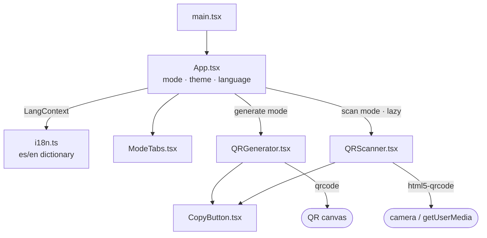

# QR Transfer — Technical Overview

> Static web application for transferring text between devices using QR codes.
> Everything runs in the browser: no backend, no database, no network.

## Table of Contents

- [Overview](#overview)
- [Purpose and Scope](#purpose-and-scope)
- [Architecture at a Glance](#architecture-at-a-glance)
- [Main Components](#main-components)
- [Technical Decisions](#technical-decisions)
- [How It Runs](#how-it-runs)
- [Development Workflow](#development-workflow)
- [Limitations](#limitations)
- [Summary](#summary)

## Overview

QR Transfer is a minimal SPA (single page, no routing) built with **Vite + React 19 + strict
TypeScript** and plain CSS. It has two modes: **Generate QR** (a textarea generates a QR code
live) and **Scan QR** (the camera reads a QR code and shows its text). The build
(`npm run build`) produces a 100% static site in `dist/` servable from any file server.

Runtime dependencies — only four: `react`, `react-dom`, `qrcode` (generation) and
`html5-qrcode` (camera reading).

## Purpose and Scope

**Does:** generate a QR code from text (up to 2000 characters), scan it from another device, and
let the user copy the text on both ends. Includes dark/light mode and es/en language support.

**Does not:** persist anything (no localStorage, no cookies, no server), interpret scanned content
(URLs are shown as plain text, never opened or executed), or transmit data over the network — the
"transfer" is purely optical, screen to camera. The full flow is documented in
[qr-transfer-flow.md](./qr-transfer-flow.md).

## Architecture at a Glance

`App` is the only owner of global state (active mode, theme, language) and applies it via
attributes on `<html>` (`data-theme`, `lang`) and a React Context for the UI strings. Everything
else is local state in each component.

## Main Components

| Component                        | Responsibility                                               | Depends on                   |
| -------------------------------- | ------------------------------------------------------------ | ---------------------------- |
| `src/App.tsx`                    | Header, tabs, theme/language buttons, mounts the active mode | `i18n.ts`, components        |
| `src/components/ModeTabs.tsx`    | Generate/Scan selector (accessible tabs)                     | `i18n.ts`                    |
| `src/components/QRGenerator.tsx` | Textarea + counter + QR canvas, Copy/Clear/Show QR buttons   | `qrcode`, `CopyButton`       |
| `src/components/QRScanner.tsx`   | Camera lifecycle, decoding, result and error handling        | `html5-qrcode`, `CopyButton` |
| `src/components/CopyButton.tsx`  | Copy to clipboard with "Copied!" feedback                    | Clipboard API                |
| `src/i18n.ts`                    | Typed es/en dictionary, `LangContext`, `useI18n()` hook      | —                            |
| `src/styles.css`                 | All styling: CSS variables, dark mode, responsive layout     | —                            |

Detail not visible from the table — **camera lifecycle** (`QRScanner`): the effect that starts the
scanner returns a cleanup that calls `stop()` + `clear()`, with a `finished` flag covering the race
between the async `start()` and unmount (if the user switches tabs while the camera is starting, the
`MediaStream` is still released). Retries and "Scan again" are modeled by incrementing a `session`
counter the effects depend on.

## Technical Decisions

- **Lazy-loaded scanner**: `html5-qrcode` is heavy, so `QRScanner` is loaded with `React.lazy`
  only when Scan mode is opened. Initial bundle ≈ 226 kB and scanner chunk ≈ 337 kB (instead of a
  single ≈ 561 kB bundle).
- **QR sharpness**: the canvas is rendered at 640 px and scaled down with CSS. The library writes
  an inline `style` with the real size; it is removed after each render so the responsive CSS wins.
- **Theming**: light palette on `:root` and dark on `:root[data-theme='dark']`, both built on CSS
  variables. The initial theme follows `prefers-color-scheme`; the initial language,
  `navigator.language`.
- **No persistence**: preferences and content live only in memory, by design.
- **Scanned content safety**: stored as a string and rendered as plain text (React escapes by
  default). No `eval`, no `dangerouslySetInnerHTML`, no auto-opening URLs.
- **Responsive layout** (760 px breakpoint): desktop in 2 columns with a `sticky` QR panel; mobile
  in a single column with the QR panel at ~85% of the screen and a "Show QR" button that
  auto-scrolls to it.

## How It Runs

- `npm run dev` → Vite dev server at `http://localhost:5173`.
- `npm run build` → `tsc -b && vite build` → static `dist/`.
- No environment variables or runtime configuration.
- The camera requires a **secure context**: `localhost` in development, **HTTPS** in production.

## Development Workflow

Installation, the full script list and deployment are covered in the [README](../README.md). The
project checks: `npm run typecheck` (strict TS), `npm run lint` (ESLint flat config),
`npm run format:check` (Prettier) and `npm run build`.

## Limitations

- **No automated tests**: verification is manual plus the static checks above.
- Real scanning between two physical devices has not been verified in this repo's development
  environment (it requires camera hardware).
- The 2000 limit is measured in characters, not bytes: text with many multibyte characters (emoji,
  CJK) can exceed the QR code's physical capacity before the limit; in that case an error is shown
  and no QR is generated.
- Switching tabs unmounts the active mode: text typed in Generate is not preserved when coming
  back (a consequence of the no-persistence decision).

## Summary

QR Transfer is a static SPA of eight source files: `App` coordinates mode, theme and language;
`QRGenerator` draws a live QR with `qrcode`; `QRScanner` manages the camera with `html5-qrcode`
and careful cleanup; `i18n.ts` and `styles.css` concentrate strings and theming. With this, a
developer can locate any change: strings go in the dictionary, styles in the CSS variables, and
all camera logic lives in a single component.
