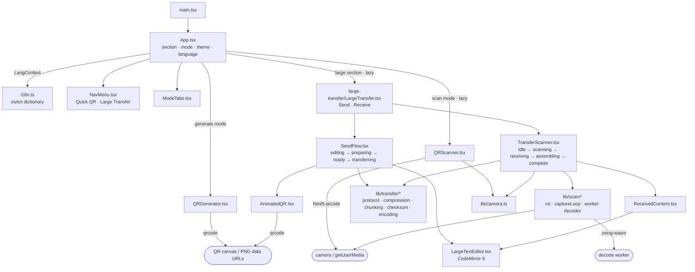

# QR Transfer — Technical Overview

> Static web application for transferring text between devices using QR codes.
> Everything runs in the browser: no backend, no database, no network.

## Table of Contents

- [Overview](#overview)
- [Purpose and Scope](#purpose-and-scope)
- [Architecture at a Glance](#architecture-at-a-glance)
- [Main Components](#main-components)
- [Technical Decisions](#technical-decisions)
- [How It Runs](#how-it-runs)
- [Development Workflow](#development-workflow)
- [Limitations](#limitations)
- [Summary](#summary)

## Overview

QR Transfer is a minimal SPA (single page, no routing) built with **Vite + React 19 + strict
TypeScript** and plain CSS. A navbar switches between two sections:

- **Quick QR** — two tabs: **Generate QR** (a textarea generates a single QR code live, up to 2000
  characters) and **Scan QR** (the camera reads one QR code and shows its text).
- **Large Transfer** — texts (Markdown, JSON, logs, configs…) or **one file** (documents, images,
  archives, small binaries) are compressed when it helps, split into chunks and shown as an
  **animated loop of QR codes** with a Reliable / Balanced / Fast profile; the receiver scans
  continuously, collects the frames in any order, verifies the SHA-256 and rebuilds the exact
  original — text to copy/view, files to download (images with preview). Detailed in
  [large-transfer.md](./large-transfer.md).

The build (`npm run build`) produces a 100% static site in `dist/` servable from any file server.

Runtime dependencies: `react`, `react-dom`, `qrcode` (generation), `zxing-wasm` (the Large Transfer
receiver's decoder, ZXing compiled to WebAssembly), `html5-qrcode` (Quick QR's scanner and the
receiver's fallback) and, only for the Large Transfer editor/viewer, individual CodeMirror 6 packages
(`@codemirror/state`, `view`, `commands`, `search`, `language`, `lang-markdown`, `lang-json`,
`@lezer/highlight`). Compression and hashing use native browser APIs (`CompressionStream`,
`crypto.subtle`), no extra libraries.

## Purpose and Scope

**Does:** generate a QR code from text and scan it from another device (Quick QR); transfer large
texts or a single file as an animated QR sequence with integrity verification (Large Transfer);
let the user copy the text / download the file on the other end. Includes dark/light mode and
es/en language support.

**Does not:** persist content (no drafts, files or received data anywhere; the only stored value is
the preferred transfer profile in `localStorage`), interpret scanned content (URLs, HTML or
Markdown are shown as plain text/source, files are only wrapped in a `Blob` — never opened,
rendered or executed), or transmit data over the network — the "transfer" is purely optical, screen
to camera. Not in scope: multiple files per transfer, encryption, receiver acknowledgements,
fountain codes / cross-frame FEC. Flows are
documented in [qr-transfer-flow.md](./qr-transfer-flow.md) and
[large-transfer.md](./large-transfer.md).

## Architecture at a Glance

`App` owns the global state (active section and mode, theme, language) and applies it via
attributes on `<html>` (`data-theme`, `lang`) and a React Context for the UI strings.
`LargeTransfer` keeps the draft text and loop speed so switching between Send and Receive does not
lose them. Everything else is local state in each component. **All byte-level and protocol logic
lives in `src/lib/transfer/` and has no React dependency.**

## Main Components

| Component / module                                    | Responsibility                                                                                                                                         | Depends on                      |
| ----------------------------------------------------- | ------------------------------------------------------------------------------------------------------------------------------------------------------ | ------------------------------- |
| `src/App.tsx`                                         | Header, navbar, theme/language buttons, mounts the active section/mode                                                                                 | `i18n.ts`, components           |
| `src/components/NavMenu.tsx`                          | Quick QR / Large Transfer navbar (`aria-current`)                                                                                                      | `i18n.ts`                       |
| `src/components/ModeTabs.tsx`                         | Generate/Scan selector (accessible tabs) inside Quick QR                                                                                               | `i18n.ts`                       |
| `src/components/QRGenerator.tsx`                      | Textarea + counter + QR canvas, Copy/Clear/Show QR buttons                                                                                             | `qrcode`, `CopyButton`          |
| `src/components/QRScanner.tsx`                        | Single-QR camera lifecycle, decoding, result and error handling                                                                                        | `html5-qrcode`, `lib/camera.ts` |
| `src/components/CopyButton.tsx`                       | Copy to clipboard with "Copied!" feedback (`label`, `small`, `primary` variants)                                                                       | Clipboard API                   |
| `src/components/large-transfer/LargeTransfer.tsx`     | Send/Receive switch; holds source, draft text, selected file and settings (profile persisted)                                                          | `SendFlow`, `TransferScanner`   |
| `src/components/large-transfer/SendFlow.tsx`          | Sender state machine: `editing → preparing → transferring`; source selector, live summary, Settings, Start                                             | `lib/transfer`, `qrFrames.ts`   |
| `src/components/large-transfer/SourceSelector.tsx`    | Text / File segmented control                                                                                                                          | —                               |
| `src/components/large-transfer/FileInput.tsx`         | Drop zone + file picker (one file; extra drops ignored)                                                                                                | —                               |
| `src/components/large-transfer/FilePreview.tsx`       | File card: name / size / MIME, image thumbnail (object URL revoked), Change / Remove                                                                   | —                               |
| `src/components/large-transfer/usePreparedPayload.ts` | Live, debounced, cancellable `preparePayload` for the current source                                                                                   | `lib/transfer`                  |
| `src/components/large-transfer/TransferSettings.tsx`  | Native `<dialog>` with Reliable / Balanced / Fast + Advanced frame duration                                                                            | `lib/transfer/profiles`         |
| `src/components/large-transfer/ReceivedFile.tsx`      | File result: sanitized name, preview for images, Download (Blob URL), Copy image, Scan another                                                         | `lib/transfer/filename`         |
| `src/components/large-transfer/LargeTextEditor.tsx`   | CodeMirror wrapper (editable or read-only viewer): toolbar, find, wrap, format, fullscreen overlay                                                     | `codemirrorSetup.ts`            |
| `src/components/large-transfer/codemirrorSetup.ts`    | Minimal CM6 extension set (history, search, keymaps, theme via CSS vars, markdown/json highlighting)                                                   | `@codemirror/*`                 |
| `src/components/large-transfer/TransferSummary.tsx`   | Live summary: original / transfer size, compression, frames and loop for the profile; size warnings                                                    | `lib/transfer/config`           |
| `src/components/large-transfer/AnimatedQR.tsx`        | Loops the pre-rendered frames, speed presets, fullscreen                                                                                               | —                               |
| `src/components/large-transfer/qrFrames.ts`           | Renders every frame once as a PNG data URL (yields to the event loop periodically)                                                                     | `qrcode`                        |
| `src/components/large-transfer/TransferScanner.tsx`   | Renders the receiver states; all imperative work lives in `useTransferScanner.ts`                                                                      | `useTransferScanner`            |
| `src/components/large-transfer/useTransferScanner.ts` | Camera lifecycle, engine choice and fallback, `ChunkCollector`, progress, auto-finish, verification                                                    | `lib/scan`, `lib/transfer`      |
| `src/lib/scan/*`                                      | Capture at camera resolution: ROI sizing, frame loop, WASM decode worker, legacy fallback                                                              | `zxing-wasm`                    |
| `src/components/large-transfer/ReceivedContent.tsx`   | "Transfer complete" screen: Copy all / View content / Scan another + read-only viewer                                                                  | `LargeTextEditor`               |
| `src/lib/transfer/*`                                  | Pure pipeline: `encoding`, `compression`, `chunking`, `checksum`, `protocol`, `filename`, `profiles`, `transfer`, `formatDetection`, `config`, `types` | Web APIs only                   |
| `src/lib/settingsStorage.ts`                          | Preferred transfer profile in `localStorage` (the only persisted value)                                                                                | —                               |
| `src/lib/camera.ts`                                   | Shared camera helpers: `buildVideoConstraints`, `listCameras`, `describeCameraError`, `stopScanner`, default `facingMode: environment`                 | `html5-qrcode` types            |
| `src/lib/format.ts`                                   | `formatBytes`, `formatNumber`, `formatSeconds`                                                                                                         | —                               |
| `src/i18n.ts`                                         | Typed es/en dictionary, `LangContext`, `useI18n()` hook                                                                                                | —                               |
| `src/styles.css`                                      | All styling: CSS variables, dark mode, responsive layout, CodeMirror palette                                                                           | —                               |

Detail not visible from the table — **camera lifecycle**, identical in both scanners even though
they now run different engines: the effect that starts the camera returns a cleanup that stops it,
with a `finished` flag covering the race between the async start and unmount (if the user switches
tabs while the camera is starting, the `MediaStream` is still released). Retries, "Scan again" and
"Cancel" are modeled by incrementing a `session` counter the effects depend on. In the receiver the
camera is also stopped automatically as soon as the last chunk arrives, before verification. Quick
QR calls `html5-qrcode`'s `stop()` + `clear()`; the receiver stops the `MediaStream` tracks and
terminates the decode worker.

## Technical Decisions

- **Lazy-loaded heavy sections**: `QRScanner` (`html5-qrcode`) and the whole `LargeTransfer`
  section (CodeMirror + scanner) are loaded with `React.lazy`, so the initial bundle only carries
  Quick QR generation. `html5-qrcode` sits in its own chunk, reached by Quick QR or — through a
  dynamic `import()` — by the receiver's fallback, so a working WASM pipeline never downloads it.
  The `.wasm` binary is emitted as a bundle asset and served locally: `zxing-wasm` otherwise
  resolves it against a CDN in production builds, which would break an app meant to work offline.
- **Protocol/bytes outside React**: `src/lib/transfer/` is plain TypeScript over `Uint8Array`, so it
  is unit-tested in Node and could later move to a Web Worker without touching components.
- **Native compression and hashing**: `CompressionStream("gzip")` / `DecompressionStream("gzip")` and
  `crypto.subtle.digest("SHA-256")` — no compression library. The whole content is compressed once
  (and only kept if it saves ≥ 2 % — images/archives travel as-is) and the transfer buffer is then
  chunked (never per-frame compression). Text and files share one binary pipeline.
- **Payload as Base64URL**: QR decoders return text, so binary travels as Base64URL (no padding) in
  ASCII frames; ~33 % overhead accepted for reliability. Encapsulated in `encoding.ts`.
- **Header frame + lean data frames (protocol v2)**: metadata (type, compression, full SHA-256 of
  the original, size, filename, MIME) travels once in frame 0; data frames carry only id / index /
  total / payload. The loop repeats the header like any frame, so the receiver never depends on
  scanning it first.
- **Profiles over knobs**: Reliable / Balanced / Fast fix chunk size, error correction and speed
  (`profiles.ts`); the expensive half of the pipeline (`preparePayload`) is independent from them,
  so switching profiles recomputes frames/loop instantly.
- **Frames pre-rendered once**: on "Start transfer" all frames become PNG data URLs; the animation
  only swaps `img.src`, so no QR work happens per tick.
- **Fullscreen as a CSS overlay**: `position: fixed; inset: 0` toggled on the _same_ wrapper element
  (editor, viewer, animated QR). CodeMirror is never remounted, so selection and undo history
  survive; `Escape` closes it (unless CodeMirror already consumed the key, e.g. closing search).
- **No Web Worker (yet)**: gzip and hashing are async native APIs and frame rendering yields every 8
  frames, so the UI stays responsive within the 2 MB limit. The pure-logic split keeps the door
  open.
- **QR sharpness**: Quick QR renders the canvas at 640 px and scales it with CSS; Large Transfer
  frames use `scale: 6` PNGs with `image-rendering: pixelated`.
- **Theming**: light palette on `:root` and dark on `:root[data-theme='dark']`, all CSS variables
  (including the CodeMirror highlight colors). Initial theme follows `prefers-color-scheme`; initial
  language, `navigator.language`. A design-system refactor is executing stage by stage — token
  values and component specs in [`DESIGN_SYSTEM.md`](./DESIGN_SYSTEM.md), folder/CSS conventions in
  [`frontend-architecture.md`](./frontend-architecture.md), and the stage sequencing in
  [`specs/design-system-refactor/macro-plan.md`](./specs/design-system-refactor/macro-plan.md).
- **Almost no persistence**: content lives only in memory (draft, file, speed survive only while
  the Large Transfer section is mounted); the sole stored value is the preferred transfer profile.
- **Content safety**: scanned/received text is stored as a string and rendered as plain text or as
  read-only editor source; received files are only wrapped in a `Blob` for download (filename
  sanitized, MIME normalized) or shown with `` when they are images. No `eval`, no
  `dangerouslySetInnerHTML`, no auto-opening URLs, no Markdown rendering.
- **Responsive layout** (760 px breakpoint): Quick QR uses 2 columns on desktop with a `sticky` QR
  panel; Large Transfer is always a vertical flow with separate screens (editor → summary → QR /
  camera → progress → result) so the editor, QR and camera get the full width.

## How It Runs

- `npm run dev` → Vite dev server at `http://localhost:5173`.
- `npm run build` → `tsc -b && vite build` → static `dist/`.
- No environment variables or runtime configuration; tunables for Large Transfer live in
  `src/lib/transfer/config.ts`.
- The camera requires a **secure context**: `localhost` in development, **HTTPS** in production.
- `CompressionStream` requires a modern browser (Chrome 80+, Safari 16.4+, Firefox 113+).

## Development Workflow

Installation, the full script list and deployment are covered in the [README](../README.md). The
project checks: `npm run typecheck` (strict TS), `npm run lint` (ESLint flat config),
`npm run format:check` (Prettier), `npm test` (Vitest, `src/**/*.test.ts`) and `npm run build`.

Tests cover the pure Large Transfer pipeline: encoding, compression decision, chunking, checksum,
protocol v2 (frames + metadata) validation, filename handling, profiles, format detection and
end-to-end round trips of text (ASCII, Spanish, emoji, CJK, Markdown, JSON, empty, ~60 KB) and
files byte-for-byte (text, PNG-like, random, empty, Unicode/path-like names, invalid MIME) with
shuffled/duplicated/missing frames, checksum mismatch, foreign transfer ids. UI components are
verified manually.

## Limitations

- **UI has no automated tests**: only the pure logic under `src/lib/` is unit-tested.
- Real scanning between two physical devices has not been verified in this repo's development
  environment (it requires camera hardware). Large Transfer frames are dense (QR version 26 with
  the Balanced profile); if a camera struggles, use **Reliable** or adjust `profiles.ts`.
- Quick QR's 2000 limit is measured in characters, not bytes: text with many multibyte characters
  (emoji, CJK) can exceed the QR code's physical capacity before the limit; in that case an error is
  shown and no QR is generated. Large Transfer measures everything in UTF-8 bytes instead.
- Large Transfer refuses transfers above 2 MB (after compression) and sources above 20 MB to
  protect memory and the main thread.
- The Large Transfer sender gets no feedback from the receiver: it loops until stopped, and the
  receiver may need more than one loop if frames are missed.
- Switching sections unmounts the active one: text typed in Generate or in the Large Transfer
  editor (and a selected file) is not preserved when coming back (a consequence of the
  no-content-persistence decision).

## Summary

QR Transfer is a static SPA with two sections. **Quick QR** keeps the original single-QR flow:
`QRGenerator` draws a live QR with `qrcode`, `QRScanner` manages the camera with `html5-qrcode`.
**Large Transfer** adds a CodeMirror editor, a file drop zone, a small versioned protocol
(`QRTransfer v2`, header + data frames), transfer profiles and a bytes → gzip? → chunk →
animated-QR pipeline implemented as pure, tested modules in `src/lib/transfer/`, with
a continuous-scan receiver that verifies integrity before showing anything. Strings go in
`i18n.ts`, styles in the CSS variables, camera helpers in `lib/camera.ts`, and byte/protocol logic
never lives inside React components.

For the visual side of the app — every screen and UI state, screenshotted in desktop/mobile and
light/dark for a design handoff — see the [Design Catalog](design/README.md).
